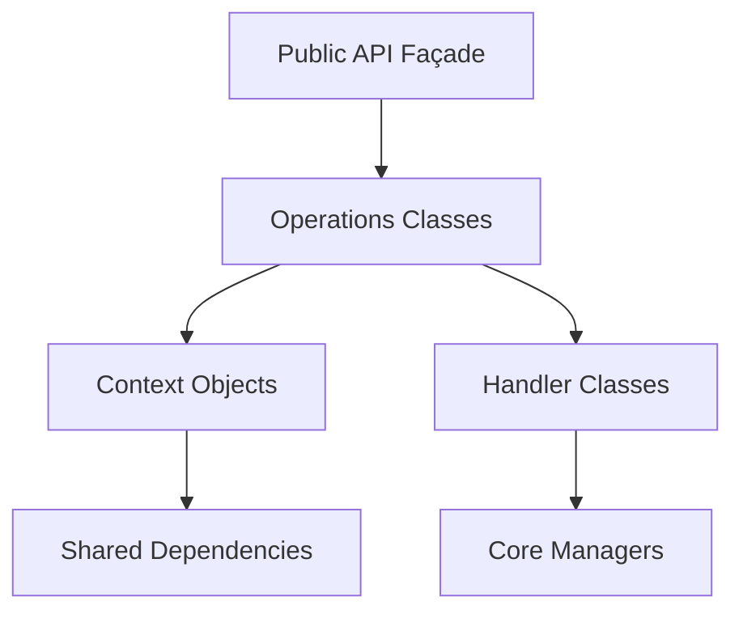

# Design Document

## Overview

This design outlines a comprehensive refactoring strategy to decompose large monolithic classes in the caTTY terminal emulator into smaller, focused components. The current codebase contains several files that exceed maintainability thresholds:

- `TerminalController.cs`: 4,363 lines
- `TerminalEmulator.cs`: 2,151 lines  
- `ProcessManager.cs`: 825 lines
- `SessionManager.cs`: 723 lines

The refactoring will use composition and delegation patterns to maintain existing functionality while achieving better code organization, searchability, and maintainability.

## Architecture

### Façade Pattern Implementation

The refactoring employs a façade pattern where large classes are decomposed into:

1. **Façade Classes**: Maintain original public APIs and delegate to implementation classes
2. **Operations Classes**: Handle specific functional areas (e.g., cursor movement, scrolling)
3. **Context Objects**: Provide shared dependencies to operations classes
4. **Handler Classes**: Process specific types of terminal sequences or events

### Dependency Flow



### File Organization Strategy

The refactoring introduces a hierarchical folder structure:

```
Terminal/
├── EmulatorOps/           # Terminal operation classes
├── ParserHandlers/        # Sequence parsing handlers  
├── Process/              # Process management components
├── Sessions/             # Session lifecycle management
└── Engine/               # Parser state machine components

Display/Controllers/
├── TerminalUi/           # UI subsystem components
└── [existing files]
```

## Components and Interfaces

### Terminal Emulator Decomposition

**Façade**: `TerminalEmulator.cs` (target: ~200 lines)
- Constructor and dependency wiring
- Public API methods (`Write`, `Resize`, `Dispose`)
- Delegation to operations classes

**Operations Classes** (target: 150-350 lines each):
- `TerminalViewportOps`: Viewport scrolling operations
- `TerminalResizeOps`: Terminal resizing logic
- `TerminalCursorMovementOps`: Cursor positioning
- `TerminalCursorSaveRestoreOps`: Cursor state management
- `TerminalCursorStyleOps`: Cursor appearance
- `TerminalEraseInDisplayOps`: Screen clearing operations
- `TerminalEraseInLineOps`: Line clearing operations
- `TerminalScrollOps`: Screen scrolling
- `TerminalScrollRegionOps`: Scroll region management
- `TerminalInsertLinesOps`: Line insertion
- `TerminalDeleteLinesOps`: Line deletion
- `TerminalInsertCharsOps`: Character insertion
- `TerminalDeleteCharsOps`: Character deletion
- `TerminalDecModeOps`: DEC mode handling
- `TerminalAlternateScreenOps`: Alternate screen buffer
- `TerminalOscTitleIconOps`: Window title/icon management
- `TerminalOscClipboardOps`: Clipboard operations
- `TerminalOscHyperlinkOps`: Hyperlink handling
- `TerminalCharsetDesignationOps`: Character set management
- `TerminalResponseOps`: Response generation
- `TerminalScreenUpdateOps`: Screen update events

### Process Manager Decomposition

**Façade**: `ProcessManager.cs` (target: ~200 lines)
- Public interface implementation
- Process lifecycle coordination
- Delegation to specialized components

**Process Components** (target: 150-300 lines each):
- `ConPtyNative.cs`: Native interop declarations
- `ShellCommandResolver.cs`: Shell path resolution
- `AttributeListBuilder.cs`: Process attribute management
- `StartupInfoBuilder.cs`: Process startup configuration
- `ConPtyOutputPump.cs`: Output reading logic
- `ConPtyInputWriter.cs`: Input writing logic
- `ProcessCleanup.cs`: Resource cleanup
- `ProcessEvents.cs`: Event handling

### Session Manager Decomposition

**Façade**: `SessionManager.cs` (target: ~200 lines)
- Public interface and coordination
- Session registry management
- Delegation to lifecycle components

**Session Components** (target: 150-300 lines each):
- `SessionRegistry.cs`: Session storage and tracking
- `SessionDimensionTracker.cs`: Size management
- `SessionCreator.cs`: Session creation logic
- `SessionCloser.cs`: Session termination
- `SessionRestarter.cs`: Session restart logic
- `SessionSwitcher.cs`: Session switching
- `SessionEventBridge.cs`: Event propagation
- `TerminalSessionFactory.cs`: Session instantiation

### Parser Engine Decomposition

**Façade**: `Parser.cs` (target: ~200 lines)
- Public parsing interface
- Byte processing coordination
- Delegation to state handlers

**Engine Components** (target: 150-300 lines each):
- `ParserEngine.cs`: Core state machine
- `ParserEngineContext.cs`: Shared parsing state
- `NormalStateHandler.cs`: Normal character processing
- `EscapeStateHandler.cs`: Escape sequence handling
- `CsiStateHandler.cs`: CSI sequence processing
- `OscStateHandler.cs`: OSC sequence processing
- `DcsStateHandler.cs`: DCS sequence processing
- `ControlStringStateHandler.cs`: Control string handling
- `RpcSequenceHandler.cs`: RPC sequence detection

### Parser Handler Decomposition

**Façade**: `TerminalParserHandlers.cs` (target: ~200 lines)
- IParserHandlers implementation
- Handler coordination
- Delegation to specialized handlers

**Handler Components** (target: 150-300 lines each):
- `SgrHandler.cs`: SGR attribute processing
- `DcsHandler.cs`: DCS command handling
- `OscHandler.cs`: OSC command processing
- `CsiDispatcher.cs`: CSI command routing
- `CsiCursorHandler.cs`: Cursor-related CSI commands
- `CsiEraseHandler.cs`: Erase-related CSI commands
- `CsiScrollHandler.cs`: Scroll-related CSI commands
- `CsiInsertDeleteHandler.cs`: Insert/delete CSI commands
- `CsiDecModeHandler.cs`: DEC mode CSI commands
- `CsiDeviceQueryHandler.cs`: Device query responses
- `CsiWindowManipulationHandler.cs`: Window manipulation
- `C0Handler.cs`: C0 control character processing
- `EscHandler.cs`: ESC sequence processing

### Display Controller Decomposition

**Façade**: `TerminalController.cs` (target: ~300 lines)
- Public interface implementation
- UI coordination and event handling
- Delegation to UI subsystems

**UI Subsystems** (target: 200-400 lines each):
- `TerminalUiFonts.cs`: Font management and metrics
- `TerminalUiRender.cs`: Terminal content rendering
- `TerminalUiInput.cs`: Input processing and capture
- `TerminalUiMouseTracking.cs`: Mouse event handling
- `TerminalUiSelection.cs`: Text selection management
- `TerminalUiResize.cs`: Window and terminal resizing
- `TerminalUiTabs.cs`: Tab rendering and management
- `TerminalUiSettingsPanel.cs`: Settings UI rendering
- `TerminalUiEvents.cs`: Event handling and propagation

## Data Models

### Context Objects

**TerminalEmulatorContext**
```csharp
internal class TerminalEmulatorContext
{
    public IScreenBufferManager ScreenBufferManager { get; }
    public ICursorManager CursorManager { get; }
    public IModeManager ModeManager { get; }
    public IAttributeManager AttributeManager { get; }
    public IScrollbackManager ScrollbackManager { get; }
    public IAlternateScreenManager AlternateScreenManager { get; }
    public ICharacterSetManager CharacterSetManager { get; }
    public IRpcHandler? RpcHandler { get; }
    public ILogger Logger { get; }
}
```

**ProcessManagerContext**
```csharp
internal class ProcessManagerContext
{
    public IntPtr PseudoConsole { get; set; }
    public IntPtr InputWriteHandle { get; set; }
    public IntPtr OutputReadHandle { get; set; }
    public Process? Process { get; set; }
    public COORD CurrentSize { get; set; }
    public CancellationTokenSource? ReadCancellationSource { get; set; }
}
```

**ParserEngineContext**
```csharp
internal class ParserEngineContext
{
    public ParserState State { get; set; }
    public List<byte> EscapeBuffer { get; }
    public List<byte> CsiBuffer { get; }
    public List<byte> OscBuffer { get; }
    public List<byte> DcsBuffer { get; }
    public IUtf8Decoder Utf8Decoder { get; }
    public IParserHandlers Handlers { get; }
    public ParserOptions Options { get; }
}
```

### Interface Preservation

All existing public interfaces remain unchanged:
- `ITerminalEmulator`
- `IProcessManager` 
- `IParserHandlers`
- `ITerminalController`

Internal interfaces may be extended to support the new architecture while maintaining backward compatibility.

## Correctness Properties

*A property is a characteristic or behavior that should hold true across all valid executions of a system-essentially, a formal statement about what the system should do. Properties serve as the bridge between human-readable specifications and machine-verifiable correctness guarantees.*

### Property 1: File Size Constraints
*For any* C# source file in the refactored codebase, the file should contain no more than 400 lines of code, with granular files targeting 150-350 lines and a hard cap of 500 lines
**Validates: Requirements 1.1, 1.5**

### Property 2: Method Size Constraints  
*For any* method in the refactored codebase, the method should contain no more than 50 lines of code
**Validates: Requirements 1.2**

### Property 3: Class Method Count Constraints
*For any* class in the refactored codebase, the class should have no more than 10 public methods
**Validates: Requirements 1.3**

### Property 4: File Class Count Constraints
*For any* C# source file in the refactored codebase, the file should contain no more than 5 class declarations
**Validates: Requirements 1.4**

### Property 5: No Partial Classes
*For any* C# source file in the refactored codebase, the file should not contain any partial class declarations
**Validates: Requirements 2.1**

### Property 6: Span-Based API Preservation
*For any* input processing method in the refactored codebase, methods that previously used ReadOnlySpan<T> parameters should continue to use ReadOnlySpan<T> parameters
**Validates: Requirements 7.3**

### Property 7: Build Success
*For any* refactoring task completion, the codebase should compile with zero errors and zero warnings
**Validates: Requirements 8.1, 8.2**

### Property 8: Nullable Reference Type Compliance
*For any* C# source file in the refactored codebase, the file should not generate nullable reference type warnings when nullable annotations are enabled
**Validates: Requirements 8.4**

### Property 9: XML Documentation Coverage
*For any* public API member (class, method, property) in the refactored codebase, the member should have XML documentation comments
**Validates: Requirements 8.5**

## Error Handling

### Refactoring Process Errors

**Build Failures**: Each refactoring task must validate by building the affected projects. If compilation fails, the task is incomplete and must be fixed before proceeding.

**Test Failures**: Each refactoring task must validate by running the relevant test suites. If tests fail, the refactoring has introduced behavioral changes and must be corrected.

**File Size Violations**: If any refactored file exceeds size constraints, further decomposition is required before the task can be considered complete.

**Dependency Violations**: If refactored classes introduce circular dependencies or violate the façade pattern, the architecture must be adjusted.

### Runtime Error Preservation

The refactoring must preserve all existing error handling behavior:

- Exception types and messages remain unchanged
- Error propagation paths are maintained
- Logging and tracing behavior is preserved
- Resource cleanup patterns are maintained

### Rollback Strategy

Each refactoring task should be implemented as atomic commits that can be reverted if validation fails:

1. Create feature branch for each major component refactoring
2. Implement refactoring in small, testable increments
3. Validate each increment before proceeding
4. Merge only after full validation passes

## Testing Strategy

### Dual Testing Approach

The refactoring validation employs both automated testing and structural verification:

**Property-Based Tests**: Verify structural constraints across the entire codebase
- File size constraints (minimum 100 iterations across all source files)
- Method size constraints (minimum 100 iterations across all methods)
- Class structure constraints (minimum 100 iterations across all classes)
- API preservation constraints (minimum 100 iterations across all public methods)

**Unit Tests**: Verify specific organizational requirements and behavioral preservation
- Existing test suite must pass without modification
- Specific architectural separations (cursor ops, parsing ops, UI ops)
- Context object scope limitations
- Build configuration compliance

**Integration Tests**: Verify end-to-end functionality preservation
- Terminal emulation behavior unchanged
- Process management functionality preserved
- Session management capabilities maintained
- Display rendering behavior identical

### Validation Workflow

Each refactoring task follows this validation sequence:

1. **Structural Validation**: Run property-based tests to verify size and organizational constraints
2. **Build Validation**: Compile all affected projects with zero warnings/errors
3. **Unit Test Validation**: Run all unit tests to verify behavioral preservation
4. **Integration Test Validation**: Run integration tests to verify end-to-end functionality
5. **Performance Validation**: Run benchmarks to verify no performance regression

### Test Configuration

**Property Test Settings**:
- Minimum 100 iterations per property test
- Each property test references its design document property
- Tag format: **Feature: code-size-refactor, Property {number}: {property_text}**

**Test Organization**:
- Property tests in `caTTY.Core.Tests/Property/RefactorValidationProperties.cs`
- Unit tests in `caTTY.Core.Tests/Unit/RefactorValidationTests.cs`
- Integration tests in existing integration test files
- Performance tests in `caTTY.Core.Tests/Performance/RefactorPerformanceTests.cs`

### Continuous Validation

The refactoring process includes continuous validation checkpoints:

- After each file extraction: build + unit tests
- After each component completion: full test suite
- After each phase completion: integration tests + performance tests
- Before final merge: complete validation suite

This ensures that issues are caught early and the refactoring maintains system integrity throughout the process.