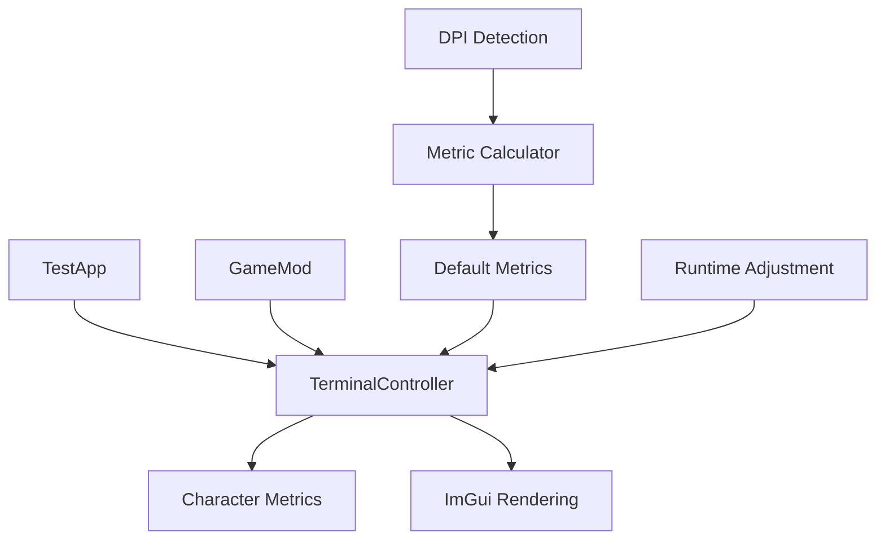

# Design Document

## Overview

This design addresses the DPI scaling issue in the caTTY terminal emulator where the GameMod version displays incorrect character spacing and font sizing compared to the standalone TestApp. The solution involves making the shared TerminalController configurable to handle different DPI contexts while maintaining backward compatibility.

The core issue is that the TestApp runs in a DPI-aware context with proper scaling, while the GameMod inherits the game's DPI context which may apply additional scaling. This results in character metrics being effectively doubled in the GameMod, causing poor text alignment and spacing.

## Architecture

The solution uses a **Configuration Injection** pattern where DPI-aware character metrics are provided to the TerminalController during initialization. This allows different contexts (TestApp vs GameMod) to provide appropriate metrics without changing the core rendering logic.



The architecture maintains the existing shared controller approach while adding configurability for different execution contexts.

## Components and Interfaces

### TerminalRenderingConfig

A new configuration class that encapsulates all rendering-related settings:

```csharp
public class TerminalRenderingConfig
{
    public float FontSize { get; set; } = 16.0f;
    public float CharacterWidth { get; set; } = 9.6f;
    public float LineHeight { get; set; } = 18.0f;
    public bool AutoDetectDpiScaling { get; set; } = true;
    public float DpiScalingFactor { get; set; } = 1.0f;
    
    public static TerminalRenderingConfig CreateForTestApp()
    {
        return new TerminalRenderingConfig
        {
            FontSize = 16.0f,
            CharacterWidth = 9.6f,
            LineHeight = 18.0f,
            AutoDetectDpiScaling = false,
            DpiScalingFactor = 1.0f
        };
    }
    
    public static TerminalRenderingConfig CreateForGameMod(float dpiScale = 2.0f)
    {
        return new TerminalRenderingConfig
        {
            FontSize = 16.0f / dpiScale,
            CharacterWidth = 9.6f / dpiScale,
            LineHeight = 18.0f / dpiScale,
            AutoDetectDpiScaling = false,
            DpiScalingFactor = dpiScale
        };
    }
    
    public void Validate()
    {
        if (FontSize <= 0 || FontSize > 72)
            throw new ArgumentException("FontSize must be between 0 and 72");
        if (CharacterWidth <= 0 || CharacterWidth > 50)
            throw new ArgumentException("CharacterWidth must be between 0 and 50");
        if (LineHeight <= 0 || LineHeight > 100)
            throw new ArgumentException("LineHeight must be between 0 and 100");
    }
}
```

### Enhanced TerminalController

The existing TerminalController will be enhanced to accept configuration:

```csharp
public class TerminalController : ITerminalController
{
    private readonly TerminalRenderingConfig _config;
    
    // Existing constructors for backward compatibility
    public TerminalController(ITerminalEmulator terminal, IProcessManager processManager)
        : this(terminal, processManager, TerminalRenderingConfig.CreateDefault())
    {
    }
    
    // New constructor with configuration
    public TerminalController(ITerminalEmulator terminal, IProcessManager processManager, TerminalRenderingConfig config)
    {
        _terminal = terminal ?? throw new ArgumentNullException(nameof(terminal));
        _processManager = processManager ?? throw new ArgumentNullException(nameof(processManager));
        _config = config ?? throw new ArgumentNullException(nameof(config));
        
        _config.Validate();
        
        // Apply configuration
        _fontSize = _config.FontSize;
        _charWidth = _config.CharacterWidth;
        _lineHeight = _config.LineHeight;
        
        // Log configuration for debugging
        LogConfiguration();
    }
    
    public void UpdateRenderingConfig(TerminalRenderingConfig newConfig)
    {
        newConfig.Validate();
        
        _fontSize = newConfig.FontSize;
        _charWidth = newConfig.CharacterWidth;
        _lineHeight = newConfig.LineHeight;
        
        LogConfiguration();
    }
    
    private void LogConfiguration()
    {
        Console.WriteLine($"TerminalController: FontSize={_fontSize}, CharWidth={_charWidth}, LineHeight={_lineHeight}, DpiScale={_config.DpiScalingFactor}");
    }
}
```

### DPI Context Detection

A utility class to detect and handle DPI scaling contexts:

```csharp
public static class DpiContextDetector
{
    public static TerminalRenderingConfig DetectAndCreateConfig()
    {
        var context = DetectExecutionContext();
        var dpiScale = DetectDpiScaling();
        
        return context switch
        {
            ExecutionContext.TestApp => TerminalRenderingConfig.CreateForTestApp(),
            ExecutionContext.GameMod => TerminalRenderingConfig.CreateForGameMod(dpiScale),
            _ => TerminalRenderingConfig.CreateDefault()
        };
    }
    
    private static ExecutionContext DetectExecutionContext()
    {
        // Check if running in game context by looking for KSA assemblies
        var assemblies = AppDomain.CurrentDomain.GetAssemblies();
        var hasKsaAssemblies = assemblies.Any(a => a.FullName?.Contains("KSA") == true);
        
        if (hasKsaAssemblies)
            return ExecutionContext.GameMod;
        
        return ExecutionContext.TestApp;
    }
    
    private static float DetectDpiScaling()
    {
        // Try to detect DPI scaling from ImGui context if available
        try
        {
            var io = BrutalImGui.GetIO();
            if (io.DisplayFramebufferScale.X > 1.0f)
                return io.DisplayFramebufferScale.X;
        }
        catch
        {
            // ImGui context not available, use system detection
        }
        
        // Fallback to common scaling factor
        return 2.0f;
    }
}

public enum ExecutionContext
{
    TestApp,
    GameMod,
    Unknown
}
```

## Data Models

### Configuration Data Flow

1. **TestApp Initialization**:
   ```csharp
   var config = TerminalRenderingConfig.CreateForTestApp();
   var controller = new TerminalController(terminal, processManager, config);
   ```

2. **GameMod Initialization**:
   ```csharp
   var config = TerminalRenderingConfig.CreateForGameMod(2.0f); // Compensate for 2x DPI scaling
   var controller = new TerminalController(terminal, processManager, config);
   ```

3. **Auto-Detection (Default)**:
   ```csharp
   var config = DpiContextDetector.DetectAndCreateConfig();
   var controller = new TerminalController(terminal, processManager, config);
   ```

### Character Positioning Calculations

All character positioning calculations will use the configured metrics:

```csharp
private void RenderCell(ImDrawListPtr drawList, float2 windowPos, int row, int col, Cell cell)
{
    var x = windowPos.X + col * _config.CharacterWidth;  // Use configured width
    var y = windowPos.Y + row * _config.LineHeight;      // Use configured height
    
    // Rest of rendering logic remains the same
}
```

## Correctness Properties

*A property is a characteristic or behavior that should hold true across all valid executions of a system-essentially, a formal statement about what the system should do. Properties serve as the bridge between human-readable specifications and machine-verifiable correctness guarantees.*

### Property Reflection

After analyzing all acceptance criteria, several properties can be consolidated to eliminate redundancy:

- Properties 1-4 (context detection) can be combined into a comprehensive context detection property
- Properties 5-8 (configuration acceptance) can be combined into a configuration handling property  
- Properties 9-11 (metric application) can be combined into a metric application property
- Properties 12-14 (runtime updates) can be combined into a runtime update property
- Properties 15-17 (validation and logging) can be combined into a validation and debugging property

### Core Properties

**Property 1: Context Detection and Configuration**
*For any* execution environment (TestApp or GameMod), the system should correctly detect the DPI context and apply appropriate default metrics, with GameMod contexts using compensated metrics (half-size for 2.0x scaling) and TestApp contexts using standard metrics
**Validates: Requirements 1.1, 1.2, 1.3, 1.4, 3.1, 3.2, 3.3**

**Property 2: Configuration Acceptance and Application**
*For any* valid TerminalRenderingConfig provided to the TerminalController, all character positioning calculations should use the configured metrics (font size, character width, line height) consistently across all rendering operations
**Validates: Requirements 2.1, 2.2, 2.3, 2.4**

**Property 3: Metric Validation and Bounds Checking**
*For any* character metrics (font size, character width, line height), the system should validate that values are within reasonable bounds (positive and within maximum limits) and reject invalid configurations with appropriate exceptions
**Validates: Requirements 2.5, 5.5, 6.2, 6.3**

**Property 4: Runtime Configuration Updates**
*For any* runtime metric update, the system should immediately apply the new values to all subsequent character positioning calculations while maintaining cursor position accuracy and grid alignment
**Validates: Requirements 5.1, 5.2, 5.3, 5.4**

**Property 5: Backward Compatibility and API Stability**
*For any* existing TerminalController usage pattern, the system should continue to work without code changes, with the ITerminalController interface remaining unchanged and automatic detection providing appropriate defaults
**Validates: Requirements 4.1, 4.2, 4.3, 4.4, 4.5**

**Property 6: Character Grid Alignment Consistency**
*For any* DPI scaling factor and character metrics combination, the system should maintain consistent character grid alignment with each character positioned at exact grid coordinates (col * charWidth, row * lineHeight)
**Validates: Requirements 3.5**

**Property 7: Configuration Override Capability**
*For any* automatic metric detection, the system should allow explicit configuration to override the detected values and use the provided configuration instead of automatic detection
**Validates: Requirements 3.4**

**Property 8: Debug Information and Logging**
*For any* TerminalController initialization or configuration change, the system should log the DPI context, chosen metrics, and provide read-only access to current configuration values for debugging purposes
**Validates: Requirements 1.5, 6.1, 6.4, 6.5**

## Error Handling

The DPI scaling fix includes comprehensive error handling for configuration and runtime scenarios:

### Configuration Validation Errors

- **Invalid Metrics**: When provided metrics are outside reasonable bounds (font size ≤ 0 or > 72, character width ≤ 0 or > 50, line height ≤ 0 or > 100), the system throws `ArgumentException` with descriptive messages
- **Null Configuration**: When null configuration is provided, the system throws `ArgumentNullException` and falls back to automatic detection
- **DPI Detection Failure**: When DPI context cannot be detected, the system logs a warning and uses safe default values (TestApp metrics)

### Runtime Update Errors

- **Invalid Runtime Metrics**: Runtime metric updates are validated using the same bounds checking as initialization, with invalid updates rejected and current configuration preserved
- **ImGui Context Errors**: When ImGui context is unavailable during DPI detection, the system catches exceptions and falls back to system-based detection methods
- **Logging Failures**: Console logging failures are caught and ignored to prevent crashes, with error handling ensuring the application continues to function

### Fallback Strategies

- **Primary**: Use provided configuration if valid
- **Secondary**: Use automatic detection based on execution context
- **Tertiary**: Use hardcoded safe defaults (TestApp metrics: 16.0f font, 9.6f width, 18.0f height)

## Testing Strategy

The DPI scaling fix uses a dual testing approach combining unit tests for specific scenarios and property-based tests for comprehensive validation:

### Unit Testing Focus

- **Configuration Creation**: Test that `CreateForTestApp()` and `CreateForGameMod()` factory methods produce correct metric values
- **Context Detection**: Test that `DpiContextDetector` correctly identifies TestApp vs GameMod environments using mocked assembly contexts
- **Validation Logic**: Test bounds checking with specific invalid values (negative numbers, extreme values)
- **Backward Compatibility**: Test that existing constructor calls continue to work without modification
- **Error Scenarios**: Test specific error conditions (null configs, invalid metrics, ImGui context failures)

### Property-Based Testing Focus

- **Configuration Consistency**: Generate random valid configurations and verify they're applied consistently across all character positioning calculations
- **Scaling Compensation**: Generate random DPI scaling factors and verify that GameMod configurations apply correct compensation (metrics / scalingFactor)
- **Runtime Updates**: Generate sequences of metric updates and verify that each update is immediately reflected in subsequent calculations
- **Grid Alignment**: Generate random terminal dimensions and metrics, verify that character positions maintain perfect grid alignment
- **Bounds Validation**: Generate random metric values and verify that validation correctly accepts valid values and rejects invalid ones

### Integration Testing

- **TestApp Integration**: Verify that TestApp continues to render correctly with automatic detection
- **GameMod Integration**: Verify that GameMod renders with correct character spacing after applying DPI compensation
- **Cross-Context Consistency**: Verify that the same terminal content renders with consistent relative positioning in both contexts (accounting for scaling)

### Property Test Configuration

- **Minimum 100 iterations** per property test to ensure comprehensive coverage
- **Test Tags**: Each property test includes comment tags referencing design document properties
  - Example: `// Feature: dpi-scaling-fix, Property 1: Context Detection and Configuration`
- **Custom Generators**: Smart generators that produce realistic DPI scaling factors (1.0f, 1.25f, 1.5f, 2.0f, 2.5f) and reasonable metric ranges
- **Shrinking Strategy**: When property tests fail, use shrinking to find minimal failing examples for easier debugging

<function_calls>
<invoke name="prework">
<parameter name="featureName">dpi-scaling-fix