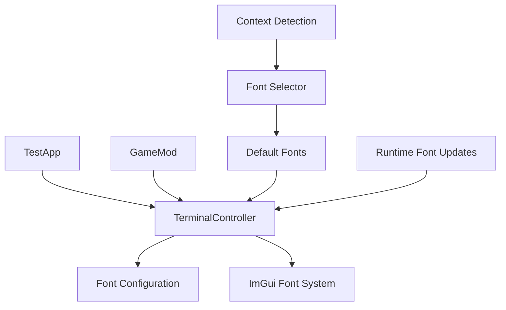

# Design Document

## Overview

This design addresses the need for flexible font configuration in the caTTY terminal emulator. The current implementation uses hardcoded font settings, but different deployment contexts (TestApp vs GameMod) may benefit from different font families, styles, and sizes. Since the KSA game renders directly with GLFW and Vulkan, it bypasses Windows DPI scaling entirely, making font selection the primary concern rather than DPI compensation.

The solution involves creating a configurable font system that allows different contexts to specify appropriate fonts while maintaining backward compatibility with existing code.

## Architecture

The solution uses a **Configuration Injection** pattern where font configuration is provided to the TerminalController during initialization. This allows different contexts (TestApp vs GameMod) to specify appropriate fonts without changing the core rendering logic.



The architecture maintains the existing shared controller approach while adding configurability for different font preferences.

## Components and Interfaces

### TerminalFontConfig

A new configuration class that encapsulates all font-related settings:

```csharp
public class TerminalFontConfig
{
    public string RegularFontName { get; set; } = "HackNerdFontMono-Regular";
    public string BoldFontName { get; set; } = "HackNerdFontMono-Bold";
    public string ItalicFontName { get; set; } = "HackNerdFontMono-Italic";
    public string BoldItalicFontName { get; set; } = "HackNerdFontMono-BoldItalic";
    public float FontSize { get; set; } = 16.0f;
    public bool AutoDetectContext { get; set; } = true;
    
    public static TerminalFontConfig CreateForTestApp()
    {
        return new TerminalFontConfig
        {
            RegularFontName = "HackNerdFontMono-Regular",
            BoldFontName = "HackNerdFontMono-Bold",
            ItalicFontName = "HackNerdFontMono-Italic",
            BoldItalicFontName = "HackNerdFontMono-BoldItalic",
            FontSize = 16.0f,
            AutoDetectContext = false
        };
    }
    
    public static TerminalFontConfig CreateForGameMod()
    {
        return new TerminalFontConfig
        {
            RegularFontName = "HackNerdFontMono-Regular",
            BoldFontName = "HackNerdFontMono-Bold",
            ItalicFontName = "HackNerdFontMono-Italic",
            BoldItalicFontName = "HackNerdFontMono-BoldItalic",
            FontSize = 14.0f, // Slightly smaller for game context
            AutoDetectContext = false
        };
    }
    
    public void Validate()
    {
        if (string.IsNullOrWhiteSpace(RegularFontName))
            throw new ArgumentException("RegularFontName cannot be null or empty");
        if (FontSize <= 0 || FontSize > 72)
            throw new ArgumentException("FontSize must be between 0 and 72");
        
        // Bold, Italic, BoldItalic can fall back to Regular if not specified
        BoldFontName ??= RegularFontName;
        ItalicFontName ??= RegularFontName;
        BoldItalicFontName ??= RegularFontName;
    }
}
```

### Enhanced TerminalController

The existing TerminalController will be enhanced to accept font configuration:

```csharp
public class TerminalController : ITerminalController
{
    private readonly TerminalFontConfig _fontConfig;
    private ImFontPtr _regularFont;
    private ImFontPtr _boldFont;
    private ImFontPtr _italicFont;
    private ImFontPtr _boldItalicFont;
    
    // Existing constructors for backward compatibility
    public TerminalController(ITerminalEmulator terminal, IProcessManager processManager)
        : this(terminal, processManager, FontContextDetector.DetectAndCreateConfig())
    {
    }
    
    // New constructor with font configuration
    public TerminalController(ITerminalEmulator terminal, IProcessManager processManager, TerminalFontConfig fontConfig)
    {
        _terminal = terminal ?? throw new ArgumentNullException(nameof(terminal));
        _processManager = processManager ?? throw new ArgumentNullException(nameof(processManager));
        _fontConfig = fontConfig ?? throw new ArgumentNullException(nameof(fontConfig));
        
        _fontConfig.Validate();
        
        // Load fonts from ImGui font system
        LoadFonts();
        
        // Calculate character metrics from loaded fonts
        CalculateCharacterMetrics();
        
        // Log configuration for debugging
        LogFontConfiguration();
    }
    
    public void UpdateFontConfig(TerminalFontConfig newConfig)
    {
        newConfig.Validate();
        
        // Update font configuration
        _fontConfig = newConfig;
        
        // Reload fonts
        LoadFonts();
        CalculateCharacterMetrics();
        
        LogFontConfiguration();
    }
    
    private void LoadFonts()
    {
        var fontManager = ImGui.GetIO().Fonts;
        
        // Try to find fonts by name, fall back to default if not found
        _regularFont = FindFont(_fontConfig.RegularFontName) ?? ImGui.GetFont();
        _boldFont = FindFont(_fontConfig.BoldFontName) ?? _regularFont;
        _italicFont = FindFont(_fontConfig.ItalicFontName) ?? _regularFont;
        _boldItalicFont = FindFont(_fontConfig.BoldItalicFontName) ?? _regularFont;
    }
    
    private ImFontPtr FindFont(string fontName)
    {
        // Implementation to find font by name in ImGui font system
        // This would iterate through loaded fonts and match by name
        return default; // Placeholder
    }
    
    private void CalculateCharacterMetrics()
    {
        // Calculate character width and height from the regular font
        var testChar = 'M'; // Use 'M' as it's typically the widest character
        var textSize = ImGui.CalcTextSize(testChar.ToString());
        
        _charWidth = textSize.X;
        _lineHeight = textSize.Y * 1.2f; // Add some line spacing
        _fontSize = _fontConfig.FontSize;
    }
    
    private void LogFontConfiguration()
    {
        Console.WriteLine($"TerminalController Font Config:");
        Console.WriteLine($"  Regular: {_fontConfig.RegularFontName}");
        Console.WriteLine($"  Bold: {_fontConfig.BoldFontName}");
        Console.WriteLine($"  Italic: {_fontConfig.ItalicFontName}");
        Console.WriteLine($"  BoldItalic: {_fontConfig.BoldItalicFontName}");
        Console.WriteLine($"  FontSize: {_fontConfig.FontSize}");
        Console.WriteLine($"  Calculated CharWidth: {_charWidth}, LineHeight: {_lineHeight}");
    }
}
```

### Font Context Detection

A utility class to detect execution context and provide appropriate font defaults:

```csharp
public static class FontContextDetector
{
    public static TerminalFontConfig DetectAndCreateConfig()
    {
        var context = DetectExecutionContext();
        
        return context switch
        {
            ExecutionContext.TestApp => TerminalFontConfig.CreateForTestApp(),
            ExecutionContext.GameMod => TerminalFontConfig.CreateForGameMod(),
            _ => TerminalFontConfig.CreateForTestApp() // Safe default
        };
    }
    
    private static ExecutionContext DetectExecutionContext()
    {
        // Check if running in game context by looking for KSA assemblies
        var assemblies = AppDomain.CurrentDomain.GetAssemblies();
        var hasKsaAssemblies = assemblies.Any(a => a.FullName?.Contains("KSA") == true);
        
        if (hasKsaAssemblies)
            return ExecutionContext.GameMod;
        
        return ExecutionContext.TestApp;
    }
}

public enum ExecutionContext
{
    TestApp,
    GameMod,
    Unknown
}
```

## Data Models

### Font Configuration Data Flow

1. **TestApp Initialization**:
   ```csharp
   var fontConfig = TerminalFontConfig.CreateForTestApp();
   var controller = new TerminalController(terminal, processManager, fontConfig);
   ```

2. **GameMod Initialization**:
   ```csharp
   var fontConfig = TerminalFontConfig.CreateForGameMod();
   var controller = new TerminalController(terminal, processManager, fontConfig);
   ```

3. **Auto-Detection (Default)**:
   ```csharp
   var fontConfig = FontContextDetector.DetectAndCreateConfig();
   var controller = new TerminalController(terminal, processManager, fontConfig);
   ```

### Character Rendering with Font Styles

All character rendering will use the appropriate font based on SGR attributes:

```csharp
private void RenderCell(ImDrawListPtr drawList, float2 windowPos, int row, int col, Cell cell)
{
    var x = windowPos.X + col * _charWidth;
    var y = windowPos.Y + row * _lineHeight;
    
    // Select appropriate font based on cell attributes
    var font = SelectFont(cell.Attributes);
    
    ImGui.PushFont(font);
    try
    {
        // Render character with selected font
        drawList.AddText(new Vector2(x, y), GetCellColor(cell), cell.Character.ToString());
    }
    finally
    {
        ImGui.PopFont();
    }
}

private ImFontPtr SelectFont(SgrAttributes attributes)
{
    if (attributes.Bold && attributes.Italic)
        return _boldItalicFont;
    else if (attributes.Bold)
        return _boldFont;
    else if (attributes.Italic)
        return _italicFont;
    else
        return _regularFont;
}
```

## Correctness Properties

*A property is a characteristic or behavior that should hold true across all valid executions of a system-essentially, a formal statement about what the system should do. Properties serve as the bridge between human-readable specifications and machine-verifiable correctness guarantees.*

### Property Reflection

After analyzing all acceptance criteria, several properties can be consolidated to eliminate redundancy:

- Properties 1-4 (font configuration acceptance) can be combined into a comprehensive font configuration property
- Properties 5-8 (context detection) can be combined into a context detection property  
- Properties 9-11 (font loading and validation) can be combined into a font loading property
- Properties 12-14 (runtime updates) can be combined into a runtime update property
- Properties 15-17 (validation and logging) can be combined into a validation and debugging property

### Core Properties

**Property 1: Font Configuration Acceptance and Application**
*For any* valid TerminalFontConfig provided to the TerminalController, the system should load the specified fonts and use them consistently for character rendering, with appropriate fallbacks when fonts are unavailable
**Validates: Requirements 1.1, 1.2, 1.3, 1.4, 2.1, 2.2**

**Property 2: Context Detection and Default Configuration**
*For any* execution environment (TestApp or GameMod), the system should correctly detect the context and apply appropriate default font configuration, with TestApp using development-friendly defaults and GameMod using game-appropriate defaults
**Validates: Requirements 3.1, 3.2, 3.3, 3.4**

**Property 3: Font Loading and Validation**
*For any* font configuration, the system should validate that font names are not empty, font sizes are within bounds (8.0f to 72.0f), and attempt to load fonts from the ImGui font system with appropriate fallbacks to available fonts
**Validates: Requirements 1.4, 2.4, 2.5, 6.2, 6.3**

**Property 4: Runtime Font Configuration Updates**
*For any* runtime font configuration update, the system should immediately reload fonts, recalculate character metrics, and apply the new configuration to all subsequent rendering operations while maintaining cursor position accuracy
**Validates: Requirements 5.1, 5.2, 5.3, 5.4, 5.5**

**Property 5: Backward Compatibility and API Stability**
*For any* existing TerminalController usage pattern, the system should continue to work without code changes, with the ITerminalController interface remaining unchanged and automatic detection providing appropriate font defaults
**Validates: Requirements 4.1, 4.2, 4.3, 4.4, 4.5**

**Property 6: Font Style Selection Consistency**
*For any* character with SGR attributes (bold, italic, bold+italic), the system should consistently select the appropriate font variant (BoldFont, ItalicFont, BoldItalicFont, or RegularFont) and render the character using that font
**Validates: Requirements 1.3, character rendering consistency**

**Property 7: Character Metrics Calculation**
*For any* loaded font configuration, the system should calculate character width and line height based on the actual font metrics, ensuring consistent character grid alignment and proper text spacing
**Validates: Requirements 2.3, character positioning accuracy**

**Property 8: Configuration Override Capability**
*For any* automatic font detection, the system should allow explicit configuration to override the detected values and use the provided font configuration instead of automatic detection
**Validates: Requirements 3.4**

**Property 9: Debug Information and Logging**
*For any* TerminalController initialization or font configuration change, the system should log the selected fonts, sizes, and calculated metrics, and provide read-only access to current configuration values for debugging purposes
**Validates: Requirements 1.5, 6.1, 6.4, 6.5**

## Error Handling

The font configuration system includes comprehensive error handling for configuration and runtime scenarios:

### Font Configuration Validation Errors

- **Invalid Font Names**: When font names are null or empty, the system logs warnings and falls back to available fonts or ImGui default fonts
- **Invalid Font Sizes**: When font sizes are outside reasonable bounds (≤ 0 or > 72), the system throws `ArgumentException` with descriptive messages
- **Font Loading Failures**: When specified fonts cannot be found in ImGui, the system logs warnings and falls back to RegularFont or ImGui default font
- **Null Configuration**: When null configuration is provided, the system throws `ArgumentNullException` and falls back to automatic detection

### Runtime Update Errors

- **Invalid Runtime Configuration**: Runtime font configuration updates are validated using the same bounds checking as initialization, with invalid updates rejected and current configuration preserved
- **Font Reload Failures**: When font reloading fails during runtime updates, the system logs errors and maintains the previous working configuration
- **ImGui Context Errors**: When ImGui font system is unavailable, the system catches exceptions and uses safe fallback fonts

### Fallback Strategies

- **Primary**: Use specified font configuration if valid and fonts are available
- **Secondary**: Use automatic detection based on execution context
- **Tertiary**: Use ImGui default font system
- **Final**: Use hardcoded safe defaults (HackNerdFontMono-Regular, 16.0f size)

## Testing Strategy

The font configuration system uses a dual testing approach combining unit tests for specific scenarios and property-based tests for comprehensive validation:

### Unit Testing Focus

- **Font Configuration Creation**: Test that `CreateForTestApp()` and `CreateForGameMod()` factory methods produce correct font names and sizes
- **Context Detection**: Test that `FontContextDetector` correctly identifies TestApp vs GameMod environments using mocked assembly contexts
- **Font Validation Logic**: Test bounds checking with specific invalid values (null names, negative sizes, extreme values)
- **Font Loading**: Test font loading from ImGui font system with available and unavailable fonts
- **Backward Compatibility**: Test that existing constructor calls continue to work without modification
- **Error Scenarios**: Test specific error conditions (null configs, invalid fonts, ImGui context failures)

**Console Output Requirements**: Unit tests MUST strive to have no stdout/stderr output under normal conditions to reduce verbosity of console output. Tests should only produce output when:
- A test fails and diagnostic information is needed
- Explicit debugging is enabled via environment variables or test flags
- Critical errors occur that require immediate attention

### Property-Based Testing Focus

- **Font Configuration Consistency**: Generate random valid font configurations and verify they're applied consistently across all character rendering operations
- **Font Style Selection**: Generate random SGR attribute combinations and verify that appropriate font variants are selected (regular, bold, italic, bold+italic)
- **Runtime Updates**: Generate sequences of font configuration updates and verify that each update is immediately reflected in subsequent rendering
- **Character Metrics**: Generate random font configurations and verify that character metrics are calculated correctly from actual font properties
- **Bounds Validation**: Generate random font sizes and names, verify that validation correctly accepts valid values and rejects invalid ones

### Integration Testing

- **TestApp Integration**: Verify that TestApp continues to render correctly with automatic font detection
- **GameMod Integration**: Verify that GameMod renders with appropriate fonts and proper character spacing
- **Cross-Context Consistency**: Verify that the same terminal content renders consistently in both contexts with appropriate font styling
- **Font Style Rendering**: Verify that bold, italic, and bold+italic text renders correctly using the appropriate font variants

### Property Test Configuration

- **Minimum 100 iterations** per property test to ensure comprehensive coverage
- **Test Tags**: Each property test includes comment tags referencing design document properties
  - Example: `// Feature: font-configuration, Property 1: Font Configuration Acceptance and Application`
- **Custom Generators**: Smart generators that produce realistic font names (from available system fonts) and reasonable size ranges (8.0f to 72.0f)
- **Shrinking Strategy**: When property tests fail, use shrinking to find minimal failing examples for easier debugging