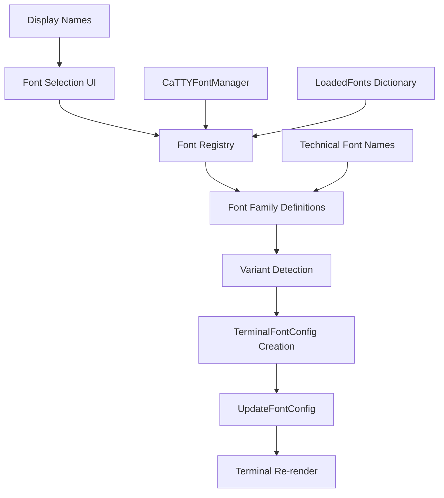

# Design Document

## Overview

This design adds a user-friendly font selection interface to the caTTY terminal emulator, building on the existing font configuration system. The solution provides a centralized font registry within CaTTYFontManager that knows about available font families and their variants, plus an ImGui menu interface that allows users to select fonts by display name. The system handles fonts with varying style availability gracefully, using fallback logic for fonts that only have Regular variants.

## Architecture

The solution extends the existing font configuration system with a **Font Registry Pattern** that centralizes knowledge about available fonts and their capabilities. The registry acts as a bridge between user-friendly display names and technical font file names, while the UI provides immediate font switching capabilities.



The architecture maintains the existing TerminalController and TerminalFontConfig interfaces while adding a new layer for font discovery and selection.

## Components and Interfaces

### Enhanced CaTTYFontManager

The existing CaTTYFontManager will be enhanced with font registry capabilities:

```csharp
public class CaTTYFontManager
{
    public static Dictionary<string, ImFontPtr> LoadedFonts = new();
    private static readonly Dictionary<string, FontFamilyDefinition> _fontRegistry = new();
    private static bool _fontsLoaded;
    private static bool _registryInitialized;

    public static void LoadFonts()
    {
        if (_fontsLoaded) return;
        
        // Existing font loading logic...
        
        // Initialize font registry after loading
        InitializeFontRegistry();
        
        _fontsLoaded = true;
    }
    
    private static void InitializeFontRegistry()
    {
        if (_registryInitialized) return;
        
        // Register font families with their variants
        RegisterFontFamily("Jet Brains Mono", "JetBrainsMonoNerdFontMono", 
            hasRegular: true, hasBold: true, hasItalic: true, hasBoldItalic: true);
        RegisterFontFamily("Space Mono", "SpaceMonoNerdFontMono", 
            hasRegular: true, hasBold: true, hasItalic: true, hasBoldItalic: true);
        RegisterFontFamily("Hack", "HackNerdFontMono", 
            hasRegular: true, hasBold: true, hasItalic: true, hasBoldItalic: true);
        RegisterFontFamily("Pro Font", "ProFontWindowsNerdFontMono", 
            hasRegular: true, hasBold: false, hasItalic: false, hasBoldItalic: false);
        RegisterFontFamily("Proggy Clean", "ProggyCleanNerdFontMono", 
            hasRegular: true, hasBold: false, hasItalic: false, hasBoldItalic: false);
        RegisterFontFamily("Shure Tech Mono", "ShureTechMonoNerdFontMono", 
            hasRegular: true, hasBold: false, hasItalic: false, hasBoldItalic: false);
        RegisterFontFamily("Departure Mono", "DepartureMonoNerdFont", 
            hasRegular: true, hasBold: false, hasItalic: false, hasBoldItalic: false);
        
        _registryInitialized = true;
    }
    
    private static void RegisterFontFamily(string displayName, string fontBaseName, 
        bool hasRegular, bool hasBold, bool hasItalic, bool hasBoldItalic)
    {
        var definition = new FontFamilyDefinition
        {
            DisplayName = displayName,
            FontBaseName = fontBaseName,
            HasRegular = hasRegular,
            HasBold = hasBold,
            HasItalic = hasItalic,
            HasBoldItalic = hasBoldItalic
        };
        
        _fontRegistry[displayName] = definition;
        
        Console.WriteLine($"Registered font family: {displayName} -> {fontBaseName}");
    }
    
    public static IReadOnlyList<string> GetAvailableFontFamilies()
    {
        return _fontRegistry.Keys.ToList().AsReadOnly();
    }
    
    public static FontFamilyDefinition? GetFontFamilyDefinition(string displayName)
    {
        return _fontRegistry.TryGetValue(displayName, out var definition) ? definition : null;
    }
    
    public static TerminalFontConfig CreateFontConfigForFamily(string displayName, float fontSize = 32.0f)
    {
        var definition = GetFontFamilyDefinition(displayName);
        if (definition == null)
        {
            Console.WriteLine($"Unknown font family: {displayName}, using default");
            return TerminalFontConfig.CreateForTestApp();
        }
        
        return new TerminalFontConfig
        {
            RegularFontName = $"{definition.FontBaseName}-Regular",
            BoldFontName = definition.HasBold ? $"{definition.FontBaseName}-Bold" : $"{definition.FontBaseName}-Regular",
            ItalicFontName = definition.HasItalic ? $"{definition.FontBaseName}-Italic" : $"{definition.FontBaseName}-Regular",
            BoldItalicFontName = definition.HasBoldItalic ? $"{definition.FontBaseName}-BoldItalic" : $"{definition.FontBaseName}-Regular",
            FontSize = fontSize,
            AutoDetectContext = false
        };
    }
    
    public static string? GetCurrentFontFamily(TerminalFontConfig currentConfig)
    {
        // Find which font family matches the current configuration
        foreach (var kvp in _fontRegistry)
        {
            var definition = kvp.Value;
            var expectedRegular = $"{definition.FontBaseName}-Regular";
            
            if (currentConfig.RegularFontName == expectedRegular)
            {
                return kvp.Key; // Return display name
            }
        }
        
        return null; // Current config doesn't match any registered family
    }
}
```

### Font Family Definition

A new data structure to represent font family information:

```csharp
public class FontFamilyDefinition
{
    public string DisplayName { get; set; } = "";
    public string FontBaseName { get; set; } = "";
    public bool HasRegular { get; set; } = true;
    public bool HasBold { get; set; } = false;
    public bool HasItalic { get; set; } = false;
    public bool HasBoldItalic { get; set; } = false;
    
    public override string ToString()
    {
        var variants = new List<string>();
        if (HasRegular) variants.Add("Regular");
        if (HasBold) variants.Add("Bold");
        if (HasItalic) variants.Add("Italic");
        if (HasBoldItalic) variants.Add("BoldItalic");
        
        return $"{DisplayName} ({string.Join(", ", variants)})";
    }
}
```

### Enhanced TerminalController with Font Selection UI

The existing TerminalController will be enhanced with font selection menu:

```csharp
public class TerminalController : ITerminalController
{
    private string _currentFontFamily = "Hack"; // Default
    private bool _showFontMenu = false;
    
    // Existing fields and constructor...
    
    public void Render()
    {
        if (!IsVisible) return;
        
        ImGui.Begin("Terminal", ref _isVisible);
        
        // Add font selection menu
        RenderFontSelectionMenu();
        
        // Existing terminal rendering...
        RenderTerminalContent();
        ProcessInputEvents();
        
        ImGui.End();
    }
    
    private void RenderFontSelectionMenu()
    {
        if (ImGui.BeginMenuBar())
        {
            if (ImGui.BeginMenu("Font"))
            {
                var availableFonts = CaTTYFontManager.GetAvailableFontFamilies();
                
                foreach (var fontFamily in availableFonts)
                {
                    bool isSelected = fontFamily == _currentFontFamily;
                    
                    if (ImGui.MenuItem(fontFamily, "", isSelected))
                    {
                        SelectFontFamily(fontFamily);
                    }
                }
                
                ImGui.EndMenu();
            }
            
            ImGui.EndMenuBar();
        }
    }
    
    private void SelectFontFamily(string displayName)
    {
        try
        {
            Console.WriteLine($"Selecting font family: {displayName}");
            
            // Create new font configuration for the selected family
            var newFontConfig = CaTTYFontManager.CreateFontConfigForFamily(displayName, _fontConfig.FontSize);
            
            // Validate the configuration
            newFontConfig.Validate();
            
            // Apply the new configuration
            UpdateFontConfig(newFontConfig);
            
            // Update current selection
            _currentFontFamily = displayName;
            
            Console.WriteLine($"Successfully switched to font family: {displayName}");
        }
        catch (Exception ex)
        {
            Console.WriteLine($"Failed to select font family {displayName}: {ex.Message}");
            // Keep current font on error
        }
    }
    
    private void InitializeCurrentFontFamily()
    {
        // Determine current font family from configuration
        var detectedFamily = CaTTYFontManager.GetCurrentFontFamily(_fontConfig);
        _currentFontFamily = detectedFamily ?? "Hack"; // Default fallback
        
        Console.WriteLine($"Initialized current font family: {_currentFontFamily}");
    }
    
    // Call InitializeCurrentFontFamily() in constructor after font config is set
}
```

## Data Models

### Font Selection Data Flow

1. **Font Registry Initialization**:
   ```csharp
   CaTTYFontManager.LoadFonts(); // Loads fonts and initializes registry
   var availableFonts = CaTTYFontManager.GetAvailableFontFamilies();
   // Returns: ["Jet Brains Mono", "Pro Font", "Proggy Clean", ...]
   ```

2. **Font Family Selection**:
   ```csharp
   var fontConfig = CaTTYFontManager.CreateFontConfigForFamily("Jet Brains Mono", 32.0f);
   // Creates TerminalFontConfig with:
   // RegularFontName = "JetBrainsMonoNerdFontMono-Regular"
   // BoldFontName = "JetBrainsMonoNerdFontMono-Bold"
   // ItalicFontName = "JetBrainsMonoNerdFontMono-Italic"
   // BoldItalicFontName = "JetBrainsMonoNerdFontMono-BoldItalic"
   ```

3. **Fallback for Limited Variants**:
   ```csharp
   var fontConfig = CaTTYFontManager.CreateFontConfigForFamily("Pro Font", 32.0f);
   // Creates TerminalFontConfig with:
   // RegularFontName = "ProFontWindowsNerdFontMono-Regular"
   // BoldFontName = "ProFontWindowsNerdFontMono-Regular" (fallback)
   // ItalicFontName = "ProFontWindowsNerdFontMono-Regular" (fallback)
   // BoldItalicFontName = "ProFontWindowsNerdFontMono-Regular" (fallback)
   ```

### Font Registry Structure

The font registry maps display names to technical details:

```csharp
private static readonly Dictionary<string, FontFamilyDefinition> _fontRegistry = new()
{
    ["Jet Brains Mono"] = new FontFamilyDefinition
    {
        DisplayName = "Jet Brains Mono",
        FontBaseName = "JetBrainsMonoNerdFontMono",
        HasRegular = true, HasBold = true, HasItalic = true, HasBoldItalic = true
    },
    ["Pro Font"] = new FontFamilyDefinition
    {
        DisplayName = "Pro Font",
        FontBaseName = "ProFontWindowsNerdFontMono",
        HasRegular = true, HasBold = false, HasItalic = false, HasBoldItalic = false
    },
    // ... other font families
};
```

## Correctness Properties

*A property is a characteristic or behavior that should hold true across all valid executions of a system-essentially, a formal statement about what the system should do. Properties serve as the bridge between human-readable specifications and machine-verifiable correctness guarantees.*

### Property Reflection

After analyzing all acceptance criteria, several properties can be consolidated:

- Properties for font registry initialization and font family definitions can be combined
- Properties for variant detection and fallback logic can be combined
- Properties for UI interaction and font selection can be combined
- Properties for integration with existing systems can be combined

### Core Properties

**Property 1: Font Registry Completeness and Accuracy**
*For any* hardcoded font family in the system, the font registry should contain a complete and accurate FontFamilyDefinition with correct display name, font base name, and variant availability flags
**Validates: Requirements 1.1, 1.2, 1.3, 1.4, 5.2, 5.3, 5.4, 9.1-9.7, 10.1-10.7**

**Property 2: Font Configuration Generation with Variant Fallback**
*For any* font family selection, the system should generate a TerminalFontConfig where fonts with all variants use appropriate variant names, and fonts with only Regular variant use Regular for all styles (Bold, Italic, BoldItalic)
**Validates: Requirements 2.1, 2.2, 2.3, 2.4, 2.5**

**Property 3: Font Selection UI State Consistency**
*For any* font selection through the UI menu, the system should immediately update the terminal font configuration, re-render with the new font, maintain cursor accuracy, and update the menu to show the newly selected font as active
**Validates: Requirements 3.1, 3.2, 3.3, 3.4, 3.5, 4.1, 4.2, 4.3, 4.4, 4.5, 6.1, 6.2, 6.3, 6.4, 6.5**

**Property 4: Current Font Family Detection**
*For any* existing TerminalFontConfig, the system should correctly identify which registered font family it corresponds to by matching the RegularFontName against registered font base names, or return null if no match is found
**Validates: Requirements 6.1, 6.2, 6.3, 6.4, 6.5**

**Property 5: Error Handling and Graceful Degradation**
*For any* invalid font selection, missing font files, or font loading failures, the system should log appropriate errors, maintain the current working font configuration, and provide user feedback without crashing the terminal
**Validates: Requirements 7.1, 7.2, 7.3, 7.4, 7.5**

**Property 6: Integration with Existing Font System**
*For any* font selection operation, the system should use the existing TerminalFontConfig class and UpdateFontConfig() method, maintain compatibility with existing explicit font configuration, and work correctly in both TestApp and GameMod contexts
**Validates: Requirements 8.1, 8.2, 8.3, 8.4, 8.5**

## Error Handling

The font selection system includes comprehensive error handling for various failure scenarios:

### Font Selection Errors

- **Invalid Font Family**: When a non-existent font family is selected, log error and maintain current font
- **Font Loading Failures**: When selected fonts cannot be loaded from ImGui, fall back to previous working configuration
- **Configuration Validation Errors**: When generated TerminalFontConfig fails validation, log error and keep current configuration
- **UI Interaction Errors**: When ImGui menu operations fail, handle gracefully without affecting terminal functionality

### Font Registry Errors

- **Registry Initialization Failures**: When font registry cannot be initialized, use safe defaults and log warnings
- **Missing Font Definitions**: When expected fonts are not found in registry, provide fallback to default fonts
- **Variant Detection Errors**: When variant availability cannot be determined, assume Regular-only and log warnings

### Integration Errors

- **UpdateFontConfig Failures**: When font configuration updates fail, maintain previous configuration and notify user
- **Character Metrics Calculation Errors**: When new font metrics cannot be calculated, use previous metrics as fallback
- **ImGui Context Errors**: When ImGui font system is unavailable, disable font selection menu but maintain terminal functionality

### Fallback Strategies

- **Primary**: Use selected font family with appropriate variant fallback
- **Secondary**: Use current working font configuration
- **Tertiary**: Use automatic detection from existing font configuration system
- **Final**: Use hardcoded safe defaults (Hack font family)

## Testing Strategy

The font selection system uses a dual testing approach combining unit tests for specific scenarios and property-based tests for comprehensive validation:

### Unit Testing Focus

- **Font Registry Initialization**: Test that all expected font families are registered with correct display names and variant flags
- **Font Configuration Generation**: Test that CreateFontConfigForFamily() produces correct configurations for fonts with different variant availability
- **Current Font Detection**: Test that GetCurrentFontFamily() correctly identifies font families from existing configurations
- **UI Menu Rendering**: Test that font selection menu displays correct options and handles selection events
- **Error Scenarios**: Test specific error conditions (invalid selections, missing fonts, configuration failures)
- **Integration Points**: Test interaction with existing TerminalController and TerminalFontConfig systems

**Console Output Requirements**: Unit tests MUST strive to have no stdout/stderr output under normal conditions to reduce verbosity of console output. Tests should only produce output when:
- A test fails and diagnostic information is needed
- Explicit debugging is enabled via environment variables or test flags
- Critical errors occur that require immediate attention

### Property-Based Testing Focus

- **Font Registry Completeness**: Generate random font family queries and verify registry contains expected entries with correct mappings
- **Variant Fallback Logic**: Generate random font selections and verify that variant fallback works correctly for fonts with limited variants
- **Font Configuration Consistency**: Generate random font family selections and verify that generated configurations are valid and use appropriate fonts
- **UI State Management**: Generate sequences of font selections and verify that UI state remains consistent with actual font configuration
- **Error Recovery**: Generate invalid font selections and verify that system recovers gracefully without losing functionality

### Integration Testing

- **TestApp Integration**: Verify that font selection menu works correctly in standalone TestApp context
- **GameMod Integration**: Verify that font selection works within KSA game mod environment
- **Cross-Context Consistency**: Verify that font selection produces consistent results in both TestApp and GameMod
- **Performance Impact**: Verify that font selection doesn't significantly impact rendering performance
- **Session Persistence**: Verify that selected fonts persist correctly during the session

### Property Test Configuration

- **Minimum 100 iterations** per property test to ensure comprehensive coverage
- **Test Tags**: Each property test includes comment tags referencing design document properties
  - Example: `// Feature: font-selection-ui, Property 1: Font Registry Completeness and Accuracy`
- **Custom Generators**: Smart generators that produce realistic font family names from the registered set and reasonable font sizes
- **Shrinking Strategy**: When property tests fail, use shrinking to find minimal failing examples for easier debugging