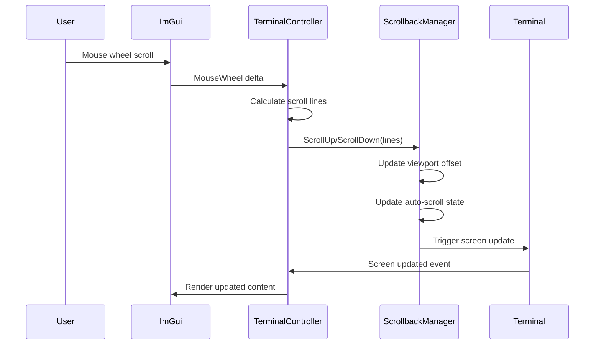

# Design Document

## Overview

Mouse wheel scrolling integration for caTTY terminal emulator ImGui display controller. This design adds mouse wheel event handling to the existing TerminalController to enable intuitive scrolling through terminal history using the mouse wheel. The implementation leverages the existing ScrollbackManager infrastructure and follows ImGui event handling patterns demonstrated in the MouseInputExperiments.cs playground.

## Architecture

### Integration Points

The mouse wheel scrolling feature integrates with existing components:

```
ImGui Event System → TerminalController → ScrollbackManager → Terminal Display
                                      ↓
                              Scroll Configuration
```

**Key Integration Points:**
- **ImGui Input System**: `ImGui.GetIO().MouseWheel` provides wheel delta values
- **TerminalController**: Enhanced `HandleInput()` method processes wheel events
- **ScrollbackManager**: Existing `ScrollUp()`, `ScrollDown()`, `ScrollToTop()`, `ScrollToBottom()` methods
- **Auto-scroll System**: Existing `AutoScrollEnabled` and `IsAtBottom` properties

### Event Flow



## Components and Interfaces

### Enhanced TerminalController

The existing `TerminalController` class will be enhanced with mouse wheel handling:

```csharp
public class TerminalController : ITerminalController
{
    // New configuration for scroll behavior
    private readonly MouseWheelScrollConfig _scrollConfig;
    
    // Wheel accumulation for smooth scrolling
    private float _wheelAccumulator = 0.0f;
    
    // Enhanced HandleInput method
    private void HandleInput()
    {
        // Existing keyboard input handling...
        
        // NEW: Mouse wheel handling
        HandleMouseWheelInput();
    }
    
    private void HandleMouseWheelInput()
    {
        var io = ImGui.GetIO();
        if (Math.Abs(io.MouseWheel) > 0.001f)
        {
            ProcessMouseWheelScroll(io.MouseWheel);
        }
    }
}
```

### Mouse Wheel Scroll Configuration

```csharp
public class MouseWheelScrollConfig
{
    /// <summary>
    /// Number of lines to scroll per mouse wheel step (default: 3)
    /// </summary>
    public int LinesPerStep { get; set; } = 3;
    
    /// <summary>
    /// Whether to enable smooth scrolling with fractional accumulation
    /// </summary>
    public bool EnableSmoothScrolling { get; set; } = true;
    
    /// <summary>
    /// Minimum wheel delta required to trigger scrolling (prevents micro-movements)
    /// </summary>
    public float MinimumWheelDelta { get; set; } = 0.1f;
    
    /// <summary>
    /// Maximum lines to scroll in a single operation (prevents excessive jumps)
    /// </summary>
    public int MaxLinesPerOperation { get; set; } = 10;
    
    public void Validate()
    {
        if (LinesPerStep < 1 || LinesPerStep > 10)
            throw new ArgumentException("LinesPerStep must be between 1 and 10");
        if (MinimumWheelDelta < 0.01f || MinimumWheelDelta > 1.0f)
            throw new ArgumentException("MinimumWheelDelta must be between 0.01 and 1.0");
        if (MaxLinesPerOperation < 1 || MaxLinesPerOperation > 50)
            throw new ArgumentException("MaxLinesPerOperation must be between 1 and 50");
    }
}
```

### Scroll Processing Algorithm

```csharp
private void ProcessMouseWheelScroll(float wheelDelta)
{
    // Accumulate wheel delta for smooth scrolling
    _wheelAccumulator += wheelDelta * _scrollConfig.LinesPerStep;
    
    // Extract integer scroll lines
    int scrollLines = (int)Math.Floor(Math.Abs(_wheelAccumulator));
    if (scrollLines == 0) return;
    
    // Determine scroll direction
    bool scrollUp = _wheelAccumulator > 0;
    
    // Clamp to maximum lines per operation
    scrollLines = Math.Min(scrollLines, _scrollConfig.MaxLinesPerOperation);
    
    // Apply scrolling via ScrollbackManager
    if (scrollUp)
    {
        _terminal.ScrollbackManager.ScrollUp(scrollLines);
    }
    else
    {
        _terminal.ScrollbackManager.ScrollDown(scrollLines);
    }
    
    // Update accumulator
    float consumedDelta = scrollLines * (scrollUp ? 1 : -1);
    _wheelAccumulator -= consumedDelta;
}
```

## Data Models

### Scroll State Tracking

The existing ScrollbackManager already provides all necessary state:

```csharp
// Existing ScrollbackManager properties used:
public interface IScrollbackManager
{
    int ViewportOffset { get; set; }     // Current scroll position
    bool IsAtBottom { get; }             // Whether at bottom of scrollback
    bool AutoScrollEnabled { get; }      // Whether auto-scroll is active
    
    void ScrollUp(int lines);            // Scroll up N lines
    void ScrollDown(int lines);          // Scroll down N lines
    void ScrollToTop();                  // Jump to top
    void ScrollToBottom();               // Jump to bottom
}
```

### Configuration Integration

The mouse wheel configuration will integrate with existing font/rendering configuration:

```csharp
public class TerminalController : ITerminalController
{
    public TerminalController(
        ITerminalEmulator terminal,
        IProcessManager processManager,
        TerminalRenderingConfig renderingConfig,
        TerminalFontConfig fontConfig,
        MouseWheelScrollConfig scrollConfig = null) // NEW parameter
    {
        _scrollConfig = scrollConfig ?? MouseWheelScrollConfig.CreateDefault();
        _scrollConfig.Validate();
        // ... existing initialization
    }
    
    // NEW: Runtime configuration update
    public void UpdateScrollConfig(MouseWheelScrollConfig newConfig)
    {
        newConfig.Validate();
        _scrollConfig = newConfig;
    }
}
```

## Error Handling

### Graceful Degradation

```csharp
private void HandleMouseWheelInput()
{
    try
    {
        var io = ImGui.GetIO();
        if (Math.Abs(io.MouseWheel) > _scrollConfig.MinimumWheelDelta)
        {
            ProcessMouseWheelScroll(io.MouseWheel);
        }
    }
    catch (Exception ex)
    {
        // Log error but don't crash terminal
        _logger?.LogWarning($"Mouse wheel scrolling error: {ex.Message}");
        
        // Reset accumulator to prevent stuck state
        _wheelAccumulator = 0.0f;
    }
}
```

### Boundary Conditions

The ScrollbackManager already handles boundary conditions:
- Scrolling up beyond available history is ignored
- Scrolling down beyond bottom is clamped to bottom
- Auto-scroll state is managed automatically

### Input Validation

```csharp
private void ProcessMouseWheelScroll(float wheelDelta)
{
    // Validate input
    if (!float.IsFinite(wheelDelta) || Math.Abs(wheelDelta) < _scrollConfig.MinimumWheelDelta)
        return;
    
    // Prevent accumulator overflow
    if (Math.Abs(_wheelAccumulator) > 100.0f)
    {
        _wheelAccumulator = Math.Sign(_wheelAccumulator) * 10.0f;
    }
    
    // ... rest of processing
}
```

## Testing Strategy

### Unit Testing Approach

**Mouse Wheel Event Processing Tests:**
- Test wheel delta accumulation and line calculation
- Test scroll direction detection (up/down)
- Test configuration parameter validation
- Test boundary condition handling
- Test error recovery and accumulator reset

**Integration Tests with ScrollbackManager:**
- Test that wheel events correctly call ScrollbackManager methods
- Test auto-scroll behavior with wheel scrolling
- Test viewport offset changes
- Test interaction with existing keyboard scrolling

**Configuration Tests:**
- Test default configuration creation
- Test runtime configuration updates
- Test invalid configuration rejection
- Test configuration persistence

### Property-Based Testing

Property tests will validate universal behaviors:
- Wheel scrolling should never leave terminal in invalid state
- Accumulated scroll amounts should always result in valid line counts
- Auto-scroll behavior should be consistent regardless of scroll method
- Configuration changes should not break existing functionality

### Performance Testing

**Hot Path Validation:**
- Mouse wheel processing should not allocate memory
- Wheel event handling should not impact rendering performance
- Rapid wheel events should be processed smoothly
- Integration with existing ImGui event loop should be seamless

### Manual Testing Scenarios

**User Experience Validation:**
- Smooth scrolling through long terminal output
- Auto-scroll behavior when new content arrives
- Scroll sensitivity feels natural and responsive
- Visual feedback clearly indicates scroll position
- Edge cases (empty terminal, full scrollback) work correctly

## Correctness Properties

*A property is a characteristic or behavior that should hold true across all valid executions of a system-essentially, a formal statement about what the system should do. Properties serve as the bridge between human-readable specifications and machine-verifiable correctness guarantees.*

### Property 1: Mouse wheel event processing and ScrollbackManager integration
*For any* mouse wheel delta value and terminal state, processing the wheel event should result in the correct ScrollbackManager method being called with the appropriate line count based on the configured sensitivity
**Validates: Requirements 1.1, 1.2, 2.1, 2.2**

### Property 2: Boundary condition handling at scroll limits
*For any* mouse wheel event when the terminal is at the top or bottom of scrollback, the system should handle the event gracefully without errors and maintain valid terminal state
**Validates: Requirements 2.3, 2.4**

### Property 3: Auto-scroll state management with wheel scrolling
*For any* sequence of wheel scroll operations, the auto-scroll state should be correctly managed: disabled when scrolling up from bottom, re-enabled when returning to bottom
**Validates: Requirements 3.1, 3.2**

### Property 4: Configuration validation and sensitivity behavior
*For any* valid scroll sensitivity configuration, wheel events should result in scrolling the exact number of lines specified by the sensitivity setting
**Validates: Requirements 4.1, 4.2, 4.3, 4.4**

### Property 5: Wheel delta accumulation and line calculation
*For any* sequence of fractional wheel delta values, the accumulation algorithm should correctly sum deltas and convert to integer line counts without losing precision or causing overflow
**Validates: Requirements 5.1, 5.2**

### Property 6: Focus-based event filtering
*For any* mouse wheel event, the system should only process the event when the terminal window has focus, ignoring events when unfocused
**Validates: Requirements 1.3**