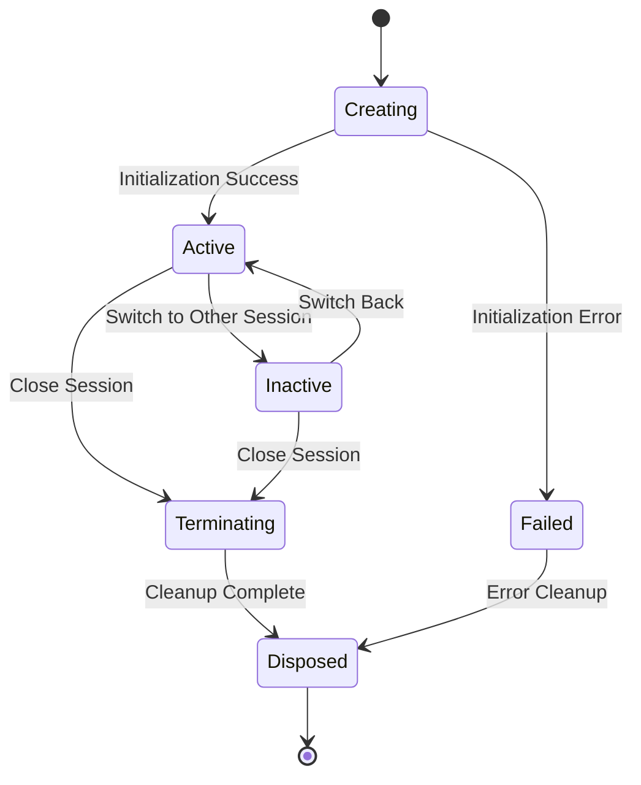

# Design Document

## Overview

This design implements multiple terminal session support for the caTTY terminal emulator by introducing a session management layer that coordinates multiple discrete terminal instances within a single window. The design maintains the existing headless terminal architecture while adding session orchestration, state isolation, and resource management capabilities.

The implementation follows the established MVC pattern where the `SessionManager` acts as a model coordinator, the `TerminalController` remains the view controller, and individual sessions encapsulate their own terminal state. Global settings (fonts, themes) are shared across sessions while session-specific state (terminal buffers, processes, titles) remains isolated.

## Architecture

### Current Single-Session Architecture
```
┌─────────────────────────────────────┐
│ TerminalController                  │
├─────────────────────────────────────┤
│ - ITerminalEmulator                 │
│ - IProcessManager                   │
│ - TerminalSettings                  │
│ - Font/Theme Config                 │
└─────────────────────────────────────┘
```

### New Multi-Session Architecture
```
┌─────────────────────────────────────┐
│ TerminalController                  │
├─────────────────────────────────────┤
│ - SessionManager                    │
│ - Global Font/Theme Config          │
│ - UI Rendering Logic                │
└─────────────────────────────────────┘
                │
                ▼
┌─────────────────────────────────────┐
│ SessionManager                      │
├─────────────────────────────────────┤
│ - List<TerminalSession>             │
│ - ActiveSessionId                   │
│ - Session Lifecycle Management      │
└─────────────────────────────────────┘
                │
                ▼
┌─────────────────────────────────────┐
│ TerminalSession (per session)       │
├─────────────────────────────────────┤
│ - ITerminalEmulator                 │
│ - IProcessManager                   │
│ - TerminalSettings                  │
│ - Session State                     │
└─────────────────────────────────────┘
```

### Session Lifecycle Flow


## Components and Interfaces

### TerminalSession Class

The `TerminalSession` class encapsulates all state and resources for a single terminal instance:

```csharp
/// <summary>
/// Represents a single terminal session with its own terminal emulator, process, and settings.
/// </summary>
public class TerminalSession : IDisposable
{
    public Guid Id { get; }
    public string Title { get; set; }
    public ITerminalEmulator Terminal { get; }
    public IProcessManager ProcessManager { get; }
    public TerminalSettings Settings { get; }
    public SessionState State { get; private set; }
    public DateTime CreatedAt { get; }
    public DateTime? LastActiveAt { get; set; }
    
    // Events for session state changes
    public event EventHandler<SessionStateChangedEventArgs>? StateChanged;
    public event EventHandler<SessionTitleChangedEventArgs>? TitleChanged;
    public event EventHandler<SessionProcessExitedEventArgs>? ProcessExited;
    
    public TerminalSession(Guid id, string title, ITerminalEmulator terminal, IProcessManager processManager)
    {
        Id = id;
        Title = title;
        Terminal = terminal;
        ProcessManager = processManager;
        Settings = new TerminalSettings { Title = title };
        State = SessionState.Creating;
        CreatedAt = DateTime.UtcNow;
        
        // Wire up events
        ProcessManager.ProcessExited += OnProcessExited;
        Terminal.TitleChanged += OnTerminalTitleChanged;
    }
    
    public async Task InitializeAsync(ProcessLaunchOptions launchOptions)
    {
        try
        {
            State = SessionState.Creating;
            await ProcessManager.StartAsync(launchOptions);
            State = SessionState.Active;
            LastActiveAt = DateTime.UtcNow;
            StateChanged?.Invoke(this, new SessionStateChangedEventArgs(State));
        }
        catch (Exception ex)
        {
            State = SessionState.Failed;
            StateChanged?.Invoke(this, new SessionStateChangedEventArgs(State, ex));
            throw;
        }
    }
    
    public void Activate()
    {
        if (State == SessionState.Inactive)
        {
            State = SessionState.Active;
            LastActiveAt = DateTime.UtcNow;
            StateChanged?.Invoke(this, new SessionStateChangedEventArgs(State));
        }
    }
    
    public void Deactivate()
    {
        if (State == SessionState.Active)
        {
            State = SessionState.Inactive;
            StateChanged?.Invoke(this, new SessionStateChangedEventArgs(State));
        }
    }
    
    public async Task CloseAsync()
    {
        if (State != SessionState.Disposed)
        {
            State = SessionState.Terminating;
            StateChanged?.Invoke(this, new SessionStateChangedEventArgs(State));
            
            try
            {
                if (ProcessManager.IsRunning)
                {
                    await ProcessManager.StopAsync();
                }
            }
            finally
            {
                Dispose();
            }
        }
    }
    
    public void Dispose()
    {
        if (State != SessionState.Disposed)
        {
            State = SessionState.Disposed;
            ProcessManager?.Dispose();
            Terminal?.Dispose();
            StateChanged?.Invoke(this, new SessionStateChangedEventArgs(State));
        }
    }
}

/// <summary>
/// Represents the current state of a terminal session.
/// </summary>
public enum SessionState
{
    Creating,
    Active,
    Inactive,
    Terminating,
    Failed,
    Disposed
}
```

### SessionManager Class

The `SessionManager` coordinates multiple terminal sessions and manages their lifecycle:

```csharp
/// <summary>
/// Manages multiple terminal sessions and coordinates their lifecycle.
/// </summary>
public class SessionManager : IDisposable
{
    private readonly Dictionary<Guid, TerminalSession> _sessions = new();
    private readonly List<Guid> _sessionOrder = new(); // For tab ordering
    private Guid? _activeSessionId;
    private readonly object _lock = new();
    private bool _disposed = false;
    
    // Configuration
    private readonly int _maxSessions;
    private readonly ProcessLaunchOptions _defaultLaunchOptions;
    
    // Events
    public event EventHandler<SessionCreatedEventArgs>? SessionCreated;
    public event EventHandler<SessionClosedEventArgs>? SessionClosed;
    public event EventHandler<ActiveSessionChangedEventArgs>? ActiveSessionChanged;
    
    public SessionManager(int maxSessions = 20, ProcessLaunchOptions? defaultLaunchOptions = null)
    {
        _maxSessions = maxSessions;
        _defaultLaunchOptions = defaultLaunchOptions ?? new ProcessLaunchOptions();
    }
    
    /// <summary>
    /// Gets the currently active session, or null if no sessions exist.
    /// </summary>
    public TerminalSession? ActiveSession
    {
        get
        {
            lock (_lock)
            {
                return _activeSessionId.HasValue && _sessions.TryGetValue(_activeSessionId.Value, out var session) 
                    ? session 
                    : null;
            }
        }
    }
    
    /// <summary>
    /// Gets all sessions in tab order.
    /// </summary>
    public IReadOnlyList<TerminalSession> Sessions
    {
        get
        {
            lock (_lock)
            {
                return _sessionOrder
                    .Where(id => _sessions.ContainsKey(id))
                    .Select(id => _sessions[id])
                    .ToList();
            }
        }
    }
    
    /// <summary>
    /// Creates a new terminal session and makes it active.
    /// </summary>
    public async Task<TerminalSession> CreateSessionAsync(string? title = null, ProcessLaunchOptions? launchOptions = null)
    {
        lock (_lock)
        {
            if (_sessions.Count >= _maxSessions)
            {
                throw new InvalidOperationException($"Maximum number of sessions ({_maxSessions}) reached");
            }
        }
        
        var sessionId = Guid.NewGuid();
        var sessionTitle = title ?? GenerateSessionTitle();
        var terminal = new TerminalEmulator();
        var processManager = new ProcessManager();
        
        var session = new TerminalSession(sessionId, sessionTitle, terminal, processManager);
        
        // Wire up session events
        session.StateChanged += OnSessionStateChanged;
        session.TitleChanged += OnSessionTitleChanged;
        session.ProcessExited += OnSessionProcessExited;
        
        lock (_lock)
        {
            _sessions[sessionId] = session;
            _sessionOrder.Add(sessionId);
            
            // Deactivate current session
            if (_activeSessionId.HasValue && _sessions.TryGetValue(_activeSessionId.Value, out var currentSession))
            {
                currentSession.Deactivate();
            }
            
            _activeSessionId = sessionId;
        }
        
        try
        {
            await session.InitializeAsync(launchOptions ?? _defaultLaunchOptions);
            session.Activate();
            
            SessionCreated?.Invoke(this, new SessionCreatedEventArgs(session));
            ActiveSessionChanged?.Invoke(this, new ActiveSessionChangedEventArgs(null, session));
            
            return session;
        }
        catch
        {
            // Cleanup on failure
            lock (_lock)
            {
                _sessions.Remove(sessionId);
                _sessionOrder.Remove(sessionId);
                if (_activeSessionId == sessionId)
                {
                    _activeSessionId = null;
                }
            }
            session.Dispose();
            throw;
        }
    }
    
    /// <summary>
    /// Switches to the specified session, making it active.
    /// </summary>
    public void SwitchToSession(Guid sessionId)
    {
        lock (_lock)
        {
            if (!_sessions.TryGetValue(sessionId, out var targetSession))
            {
                throw new ArgumentException($"Session {sessionId} not found");
            }
            
            if (_activeSessionId == sessionId)
            {
                return; // Already active
            }
            
            var previousSession = _activeSessionId.HasValue && _sessions.TryGetValue(_activeSessionId.Value, out var prev) 
                ? prev 
                : null;
            
            // Deactivate current session
            previousSession?.Deactivate();
            
            // Activate target session
            _activeSessionId = sessionId;
            targetSession.Activate();
            
            ActiveSessionChanged?.Invoke(this, new ActiveSessionChangedEventArgs(previousSession, targetSession));
        }
    }
    
    /// <summary>
    /// Closes the specified session and cleans up its resources.
    /// </summary>
    public async Task CloseSessionAsync(Guid sessionId)
    {
        TerminalSession? sessionToClose = null;
        TerminalSession? newActiveSession = null;
        
        lock (_lock)
        {
            if (!_sessions.TryGetValue(sessionId, out sessionToClose))
            {
                return; // Session doesn't exist
            }
            
            // Prevent closing the last session
            if (_sessions.Count == 1)
            {
                throw new InvalidOperationException("Cannot close the last remaining session");
            }
            
            _sessions.Remove(sessionId);
            _sessionOrder.Remove(sessionId);
            
            // If this was the active session, find a new active session
            if (_activeSessionId == sessionId)
            {
                _activeSessionId = null;
                
                // Find the next session in order, or the previous one
                var remainingIds = _sessionOrder.Where(id => _sessions.ContainsKey(id)).ToList();
                if (remainingIds.Any())
                {
                    var newActiveId = remainingIds.First();
                    _activeSessionId = newActiveId;
                    newActiveSession = _sessions[newActiveId];
                }
            }
        }
        
        // Perform cleanup outside the lock
        try
        {
            await sessionToClose.CloseAsync();
            SessionClosed?.Invoke(this, new SessionClosedEventArgs(sessionToClose));
            
            if (newActiveSession != null)
            {
                newActiveSession.Activate();
                ActiveSessionChanged?.Invoke(this, new ActiveSessionChangedEventArgs(sessionToClose, newActiveSession));
            }
        }
        catch (Exception ex)
        {
            Console.WriteLine($"SessionManager: Error closing session {sessionId}: {ex.Message}");
        }
    }
    
    /// <summary>
    /// Switches to the next session in tab order.
    /// </summary>
    public void SwitchToNextSession()
    {
        lock (_lock)
        {
            if (_sessions.Count <= 1 || !_activeSessionId.HasValue)
            {
                return;
            }
            
            var currentIndex = _sessionOrder.IndexOf(_activeSessionId.Value);
            var nextIndex = (currentIndex + 1) % _sessionOrder.Count;
            var nextSessionId = _sessionOrder[nextIndex];
            
            SwitchToSession(nextSessionId);
        }
    }
    
    /// <summary>
    /// Switches to the previous session in tab order.
    /// </summary>
    public void SwitchToPreviousSession()
    {
        lock (_lock)
        {
            if (_sessions.Count <= 1 || !_activeSessionId.HasValue)
            {
                return;
            }
            
            var currentIndex = _sessionOrder.IndexOf(_activeSessionId.Value);
            var prevIndex = currentIndex == 0 ? _sessionOrder.Count - 1 : currentIndex - 1;
            var prevSessionId = _sessionOrder[prevIndex];
            
            SwitchToSession(prevSessionId);
        }
    }
    
    /// <summary>
    /// Applies font configuration changes to all sessions.
    /// </summary>
    public void ApplyFontConfigToAllSessions(TerminalFontConfig fontConfig)
    {
        lock (_lock)
        {
            foreach (var session in _sessions.Values)
            {
                // Trigger terminal resize for each session
                // This will be handled by the TerminalController
                // which will call session.Terminal.Resize() for each session
            }
        }
    }
    
    private string GenerateSessionTitle()
    {
        lock (_lock)
        {
            var sessionNumber = _sessions.Count + 1;
            return $"Terminal {sessionNumber}";
        }
    }
    
    private void OnSessionStateChanged(object? sender, SessionStateChangedEventArgs e)
    {
        // Handle session state changes
        if (e.NewState == SessionState.Failed && sender is TerminalSession failedSession)
        {
            Console.WriteLine($"SessionManager: Session {failedSession.Id} failed: {e.Error?.Message}");
        }
    }
    
    private void OnSessionTitleChanged(object? sender, SessionTitleChangedEventArgs e)
    {
        // Propagate title changes for UI updates
    }
    
    private void OnSessionProcessExited(object? sender, SessionProcessExitedEventArgs e)
    {
        // Handle process exit - could auto-close session or show exit status
        if (sender is TerminalSession session)
        {
            Console.WriteLine($"SessionManager: Process in session {session.Id} exited with code {e.ExitCode}");
        }
    }
    
    public void Dispose()
    {
        if (!_disposed)
        {
            lock (_lock)
            {
                foreach (var session in _sessions.Values)
                {
                    try
                    {
                        session.Dispose();
                    }
                    catch (Exception ex)
                    {
                        Console.WriteLine($"SessionManager: Error disposing session {session.Id}: {ex.Message}");
                    }
                }
                _sessions.Clear();
                _sessionOrder.Clear();
                _activeSessionId = null;
            }
            _disposed = true;
        }
    }
}
```

### TerminalController Integration

The existing `TerminalController` will be modified to use the `SessionManager`:

```csharp
public class TerminalController : ITerminalController
{
    // Replace single terminal/process with session manager
    private readonly SessionManager _sessionManager;
    
    // Keep global configuration
    private readonly TerminalRenderingConfig _config;
    private TerminalFontConfig _fontConfig;
    private MouseWheelScrollConfig _scrollConfig;
    
    // UI state remains the same
    private bool _isVisible = true;
    private TextSelection _currentSelection = TextSelection.None;
    private bool _isSelecting = false;
    
    public TerminalController(TerminalRenderingConfig config, TerminalFontConfig fontConfig)
    {
        _config = config;
        _fontConfig = fontConfig;
        _sessionManager = new SessionManager();
        
        // Wire up session manager events
        _sessionManager.ActiveSessionChanged += OnActiveSessionChanged;
        _sessionManager.SessionCreated += OnSessionCreated;
        _sessionManager.SessionClosed += OnSessionClosed;
    }
    
    public void Render()
    {
        if (!_isVisible) return;
        
        EnsureFontsLoaded();
        PushMonospaceFont(out bool fontUsed);
        
        try
        {
            ImGui.Begin("Terminal", ref _isVisible, ImGuiWindowFlags.NoScrollbar | ImGuiWindowFlags.NoScrollWithMouse);
            
            UpdateFocusState(ImGui.IsWindowFocused());
            ManageInputCapture();
            
            RenderMenuBar();
            RenderTabArea();
            RenderSettingsArea();
            RenderTerminalCanvas();
            
            RenderFocusIndicators();
            
            if (HasFocus)
            {
                HandleInput();
            }
            
            ImGui.End();
        }
        finally
        {
            MaybePopFont(fontUsed);
        }
    }
    
    private void RenderTabArea()
    {
        var sessions = _sessionManager.Sessions;
        var activeSession = _sessionManager.ActiveSession;
        
        float availableWidth = ImGui.GetContentRegionAvail().X;
        float addButtonWidth = LayoutConstants.ADD_BUTTON_WIDTH;
        float totalTabWidth = availableWidth - addButtonWidth - LayoutConstants.ELEMENT_SPACING;
        float tabWidth = sessions.Count > 0 ? totalTabWidth / sessions.Count : totalTabWidth;
        
        // Render session tabs
        for (int i = 0; i < sessions.Count; i++)
        {
            var session = sessions[i];
            bool isActive = session == activeSession;
            
            if (i > 0) ImGui.SameLine();
            
            // Style active tab differently
            if (isActive)
            {
                ImGui.PushStyleColor(ImGuiCol.Button, new float4(0.2f, 0.3f, 0.5f, 1.0f));
            }
            
            string tabLabel = $"{session.Title}##tab_{session.Id}";
            if (session.ProcessManager.ExitCode.HasValue)
            {
                tabLabel += $" (Exit: {session.ProcessManager.ExitCode})";
            }
            
            if (ImGui.Button(tabLabel, new float2(tabWidth, LayoutConstants.TAB_AREA_HEIGHT - 5)))
            {
                _sessionManager.SwitchToSession(session.Id);
            }
            
            // Context menu for tab
            if (ImGui.IsItemClicked(ImGuiMouseButton.Right))
            {
                ImGui.OpenPopup($"tab_context_{session.Id}");
            }
            
            if (ImGui.BeginPopup($"tab_context_{session.Id}"))
            {
                if (ImGui.MenuItem("Close Tab") && sessions.Count > 1)
                {
                    _ = Task.Run(async () => await _sessionManager.CloseSessionAsync(session.Id));
                }
                if (ImGui.MenuItem("Rename Tab"))
                {
                    // TODO: Implement tab renaming
                }
                ImGui.EndPopup();
            }
            
            if (isActive)
            {
                ImGui.PopStyleColor();
            }
        }
        
        // Add button
        if (sessions.Count > 0) ImGui.SameLine();
        if (ImGui.Button("+##add_terminal", new float2(addButtonWidth, LayoutConstants.TAB_AREA_HEIGHT - 5)))
        {
            _ = Task.Run(async () => await _sessionManager.CreateSessionAsync());
        }
        
        if (ImGui.IsItemHovered())
        {
            ImGui.SetTooltip("Add new terminal session");
        }
    }
    
    private void RenderTerminalCanvas()
    {
        var activeSession = _sessionManager.ActiveSession;
        if (activeSession == null)
        {
            // No sessions - show placeholder
            ImGui.Text("No terminal sessions. Click + to create one.");
            return;
        }
        
        // Calculate available space for terminal content
        float2 availableSize = ImGui.GetContentRegionAvail();
        
        // Update terminal dimensions for active session
        HandleCanvasResize(activeSession, availableSize);
        
        // Render terminal content for active session
        RenderTerminalContentForSession(activeSession, availableSize);
    }
    
    private void HandleCanvasResize(TerminalSession session, float2 availableSize)
    {
        var newDimensions = CalculateTerminalDimensions(availableSize);
        if (newDimensions.HasValue)
        {
            var (newCols, newRows) = newDimensions.Value;
            if (newCols != session.Terminal.Width || newRows != session.Terminal.Height)
            {
                session.Terminal.Resize(newCols, newRows);
                if (session.ProcessManager.IsRunning)
                {
                    session.ProcessManager.Resize(newCols, newRows);
                }
            }
        }
    }
    
    private void HandleInput()
    {
        var activeSession = _sessionManager.ActiveSession;
        if (activeSession == null) return;
        
        // Route all input to active session
        // ... existing input handling logic, but using activeSession.ProcessManager
    }
    
    public void UpdateFontConfig(TerminalFontConfig newFontConfig)
    {
        _fontConfig = newFontConfig;
        LoadFonts();
        CalculateCharacterMetrics();
        
        // Apply font changes to all sessions
        _sessionManager.ApplyFontConfigToAllSessions(newFontConfig);
        
        // Trigger resize for all sessions
        TriggerTerminalResizeForAllSessions();
    }
    
    private void TriggerTerminalResizeForAllSessions()
    {
        var sessions = _sessionManager.Sessions;
        float2 currentWindowSize = ImGui.GetWindowSize();
        
        foreach (var session in sessions)
        {
            var newDimensions = CalculateTerminalDimensions(currentWindowSize);
            if (newDimensions.HasValue)
            {
                var (newCols, newRows) = newDimensions.Value;
                if (newCols != session.Terminal.Width || newRows != session.Terminal.Height)
                {
                    session.Terminal.Resize(newCols, newRows);
                    if (session.ProcessManager.IsRunning)
                    {
                        session.ProcessManager.Resize(newCols, newRows);
                    }
                }
            }
        }
    }
}
```

## Data Models

### Event Arguments

```csharp
public class SessionCreatedEventArgs : EventArgs
{
    public TerminalSession Session { get; }
    public SessionCreatedEventArgs(TerminalSession session) => Session = session;
}

public class SessionClosedEventArgs : EventArgs
{
    public TerminalSession Session { get; }
    public SessionClosedEventArgs(TerminalSession session) => Session = session;
}

public class ActiveSessionChangedEventArgs : EventArgs
{
    public TerminalSession? PreviousSession { get; }
    public TerminalSession? NewSession { get; }
    public ActiveSessionChangedEventArgs(TerminalSession? previous, TerminalSession? newSession)
    {
        PreviousSession = previous;
        NewSession = newSession;
    }
}

public class SessionStateChangedEventArgs : EventArgs
{
    public SessionState NewState { get; }
    public Exception? Error { get; }
    public SessionStateChangedEventArgs(SessionState newState, Exception? error = null)
    {
        NewState = newState;
        Error = error;
    }
}

public class SessionTitleChangedEventArgs : EventArgs
{
    public string OldTitle { get; }
    public string NewTitle { get; }
    public SessionTitleChangedEventArgs(string oldTitle, string newTitle)
    {
        OldTitle = oldTitle;
        NewTitle = newTitle;
    }
}

public class SessionProcessExitedEventArgs : EventArgs
{
    public int ExitCode { get; }
    public SessionProcessExitedEventArgs(int exitCode) => ExitCode = exitCode;
}
```

### Session Persistence Model

```csharp
/// <summary>
/// Represents session information that can be persisted and restored.
/// </summary>
public class SessionPersistenceInfo
{
    public string Title { get; set; } = "";
    public string WorkingDirectory { get; set; } = "";
    public bool WasActive { get; set; }
    public DateTime CreatedAt { get; set; }
    public DateTime LastActiveAt { get; set; }
    
    public static SessionPersistenceInfo FromSession(TerminalSession session)
    {
        return new SessionPersistenceInfo
        {
            Title = session.Title,
            WorkingDirectory = Environment.CurrentDirectory, // TODO: Get actual working directory
            WasActive = session.State == SessionState.Active,
            CreatedAt = session.CreatedAt,
            LastActiveAt = session.LastActiveAt ?? DateTime.UtcNow
        };
    }
}

/// <summary>
/// Handles saving and restoring session information across application restarts.
/// </summary>
public class SessionPersistenceManager
{
    private readonly string _persistenceFilePath;
    
    public SessionPersistenceManager(string persistenceFilePath = "sessions.json")
    {
        _persistenceFilePath = persistenceFilePath;
    }
    
    public async Task SaveSessionsAsync(IEnumerable<TerminalSession> sessions)
    {
        var sessionInfos = sessions.Select(SessionPersistenceInfo.FromSession).ToList();
        var json = JsonSerializer.Serialize(sessionInfos, new JsonSerializerOptions { WriteIndented = true });
        await File.WriteAllTextAsync(_persistenceFilePath, json);
    }
    
    public async Task<List<SessionPersistenceInfo>> LoadSessionsAsync()
    {
        if (!File.Exists(_persistenceFilePath))
        {
            return new List<SessionPersistenceInfo>();
        }
        
        try
        {
            var json = await File.ReadAllTextAsync(_persistenceFilePath);
            return JsonSerializer.Deserialize<List<SessionPersistenceInfo>>(json) ?? new List<SessionPersistenceInfo>();
        }
        catch (Exception ex)
        {
            Console.WriteLine($"SessionPersistenceManager: Error loading sessions: {ex.Message}");
            return new List<SessionPersistenceInfo>();
        }
    }
}
```

Now I need to use the prework tool to analyze the acceptance criteria before writing the correctness properties:

<function_calls>
<invoke name="prework">
<parameter name="featureName">multi-session-support

## Correctness Properties

*A property is a characteristic or behavior that should hold true across all valid executions of a system-essentially, a formal statement about what the system should do. Properties serve as the bridge between human-readable specifications and machine-verifiable correctness guarantees.*

### Property Reflection

After analyzing all acceptance criteria, several properties can be consolidated:
- Session collection management properties (1.1, 1.2, 1.3) can be combined into a comprehensive session lifecycle property
- Resource cleanup properties (1.4, 4.2, 10.1, 10.2) can be combined into a single resource management property
- State isolation properties (5.1, 5.2, 5.3, 5.4) can be combined into a single session state isolation property
- Input routing properties (8.1, 8.2, 8.4, 8.5) can be combined into a single input routing property
- Global configuration properties (6.1, 6.2, 6.5) can be combined into a single global settings propagation property

### Property 1: Session Lifecycle Management
*For any* session manager operation (create, close, switch), the session collection should maintain unique identifiers, proper resource allocation, and correct active session tracking
**Validates: Requirements 1.1, 1.2, 1.3, 1.5, 2.1, 2.4**

### Property 2: Session Creation and Initialization
*For any* new session creation, the session should be initialized with default configuration, assigned a unique title, and have its shell process started automatically
**Validates: Requirements 2.2, 2.3, 2.5**

### Property 3: Tab Management Consistency
*For any* set of active sessions, the number of displayed tabs should equal the number of sessions, with tab labels matching session titles
**Validates: Requirements 3.1, 3.4**

### Property 4: Session Switching Behavior
*For any* session switch operation, the target session should become active and the previous session should become inactive
**Validates: Requirements 3.2, 4.3**

### Property 5: Resource Cleanup on Session Closure
*For any* session closure operation, all associated resources (TerminalEmulator, ProcessManager, shell process) should be properly disposed and cleaned up
**Validates: Requirements 1.4, 4.1, 4.2, 10.1, 10.2**

### Property 6: Last Session Protection
*For any* session manager state with only one remaining session, attempting to close that session should either fail or create a new default session
**Validates: Requirements 4.4, 4.5**

### Property 7: Session State Isolation
*For any* session switch operation, each session should preserve its terminal buffer content, cursor position, scrollback history, and process state independently
**Validates: Requirements 5.1, 5.2, 5.3, 5.4**

### Property 8: Input Routing to Active Session
*For any* input event (keyboard, mouse, scroll), the input should be routed exclusively to the currently active session
**Validates: Requirements 5.5, 8.1, 8.2, 8.4, 8.5**

### Property 9: Global Settings Propagation
*For any* global configuration change (font, theme), the change should be applied to all active sessions simultaneously
**Validates: Requirements 6.1, 6.2, 6.3, 6.4, 6.5**

### Property 10: Session-Specific Settings Isolation
*For any* session-specific setting change, the change should apply only to that session and be preserved when switching between sessions
**Validates: Requirements 7.1, 7.2, 7.4, 7.5**

### Property 11: Process Lifecycle Event Handling
*For any* session process exit event, the session state should be updated to reflect the exit and the exit code should be displayed appropriately
**Validates: Requirements 9.1, 9.2**

### Property 12: Session Recovery and Error Handling
*For any* session creation failure or restoration failure, the system should handle the error gracefully without crashing and provide fallback behavior
**Validates: Requirements 9.3, 9.4, 11.5**

### Property 13: Resource Limits and Monitoring
*For any* session manager state, the number of concurrent sessions should not exceed the configured maximum, and resource usage information should be available
**Validates: Requirements 10.4, 10.5**

### Property 14: Session Persistence Round-Trip
*For any* set of sessions saved during application close, the same number of sessions with matching titles and working directories should be restored on application start
**Validates: Requirements 11.1, 11.2, 11.3, 11.4**

### Property 15: Menu State Consistency
*For any* session manager state, menu items should be enabled/disabled appropriately based on the current number of sessions and context
**Validates: Requirements 12.5**

## Error Handling

### Session Creation Failures
- If terminal emulator initialization fails, clean up partial session state and throw descriptive exception
- If process manager startup fails, dispose of terminal resources and propagate the error
- If maximum session limit is reached, reject creation with clear error message
- Log all session creation failures for debugging and monitoring

### Session Closure Errors
- If process termination fails, force-kill the process after timeout and continue cleanup
- If resource disposal fails, log the error but continue with other cleanup operations
- If the last session closure is attempted, either prevent it or create a replacement session
- Handle concurrent session closure attempts gracefully with proper locking

### Session Switching Errors
- If target session doesn't exist, ignore the switch request and log the error
- If session state is invalid (disposed, failed), skip activation and clean up the session
- If session switching fails during UI updates, revert to previous active session
- Ensure active session is always valid or null, never pointing to invalid sessions

### Resource Management Errors
- If font resource sharing fails, fall back to per-session font loading
- If memory monitoring fails, continue operation but disable monitoring features
- If session persistence fails, continue operation but warn about lost session state
- Implement circuit breaker pattern for repeated session creation failures

### Input Routing Errors
- If active session is null or invalid, ignore input events rather than crashing
- If input processing fails for active session, log error but continue accepting input
- If mouse coordinate conversion fails, fall back to approximate positioning
- Ensure input events never reach disposed or failed sessions

## Quiet Operation Guidelines

### Happy Path Silence
The session management system follows a "quiet by default" philosophy for normal operations:
- **No Console Output**: Session creation, switching, and closure should produce no stdout/stderr output during normal operation
- **Event-Driven Notifications**: Status changes are communicated through events, not console logging
- **Silent Resource Management**: Font loading, memory allocation, and cleanup operations should be silent when successful
- **Minimal Logging**: Only log errors, warnings, or debug information when explicitly enabled

### Test Environment Silence
All tests must operate silently to avoid cluttering test output:
- **Property Tests**: Use `QuietOnSuccess = true` to suppress successful test output
- **Unit Tests**: Avoid console output in test methods and setup/teardown
- **Integration Tests**: Mock or suppress any components that produce console output
- **Error Testing**: When testing error conditions, capture and verify error messages without printing them

### Error Reporting Strategy
When errors do occur, use appropriate channels:
- **Development**: Use structured logging with configurable levels (Debug, Info, Warning, Error)
- **Production**: Route errors through event system for UI display or external logging
- **Testing**: Capture errors in test assertions rather than printing to console
- **Debugging**: Provide optional verbose modes that can be enabled when needed

### Implementation Guidelines
- Replace `Console.WriteLine` with event notifications or structured logging
- Use `// Log error but continue` comments to document where logging would occur
- Implement `ILogger` interfaces for components that need diagnostic output
- Provide configuration options to enable verbose output when debugging
- Ensure all background operations (process management, resource cleanup) are silent by default

## Testing Strategy

### Unit Tests
Unit tests will verify specific examples and edge cases:
- Session creation with valid and invalid parameters
- Session closure with single session vs multiple sessions
- Session switching with valid and invalid session IDs
- Resource cleanup verification after session disposal
- Menu item state with different session counts
- Error handling for session creation failures
- Persistence save/load with various session configurations

### Property-Based Tests
Property-based tests will verify universal properties across many inputs:
- **Session lifecycle property**: Generate random session operations and verify collection consistency
- **Session initialization property**: Test session creation with random titles and configurations
- **Tab consistency property**: Generate random session sets and verify tab display matches
- **Session switching property**: Test switching between random sessions and verify state changes
- **Resource cleanup property**: Test session closure and verify all resources are disposed
- **Last session protection property**: Test closure attempts on single sessions
- **State isolation property**: Generate random session states and verify isolation after switches
- **Input routing property**: Generate random input events and verify routing to active session only
- **Global settings property**: Test configuration changes and verify propagation to all sessions
- **Settings isolation property**: Test session-specific changes and verify isolation
- **Process lifecycle property**: Test process exit scenarios and verify state updates
- **Error handling property**: Generate failure conditions and verify graceful handling
- **Resource limits property**: Test session creation up to and beyond limits
- **Persistence property**: Test save/restore cycles with random session configurations
- **Menu consistency property**: Test menu states with various session configurations

Each property test will run a minimum of 100 iterations to ensure comprehensive coverage through randomization. Tests will be tagged with the format: **Feature: multi-session-support, Property N: [property description]** to link back to design properties.

### Integration Tests
- Test complete session lifecycle from creation through closure
- Verify session switching with active terminal operations (input/output)
- Test font configuration changes affecting multiple active sessions
- Verify session persistence across application restart cycles
- Test resource cleanup under high session creation/closure load
- Verify UI responsiveness with maximum number of sessions
- Test error recovery scenarios with process failures and resource exhaustion