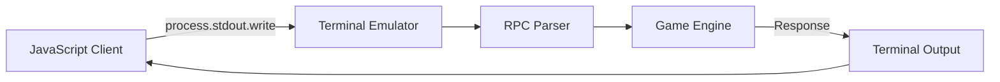

# Design Document: Terminal Sequence RPC

## Overview

The Terminal Sequence RPC system enables shell programs to communicate with the game through private use area escape sequences (ESC [ > format). This design maintains clean separation between the VT100/xterm-compliant core terminal emulator and the game-specific RPC functionality.

The system uses the established private use area pattern (ESC [ > Pn ; Pv ; Pc) to avoid conflicts with standard terminal sequences. When the core parser detects these sequences, it delegates processing to dedicated RPC handlers without affecting core emulation logic.

## Architecture

### High-Level Components

```mermaid
graph TB
    A[Shell Program] -->|ESC [ > 1001;1;F| B[Terminal Parser]
    B --> C{Sequence Type}
    C -->|Standard| D[Core Terminal Handlers]
    C -->|Private Use Area| E[RPC Sequence Detector]
    E --> F[RPC Command Router]
    F --> G[Game Action Handler]
    G --> H[KSA Game Engine]
    
    F -->|Query Response| I[RPC Response Generator]
    I -->|ESC [ > 2001;1;R| J[PTY Output]
    J --> A
```

### Client Application Architecture

The JavaScript client application serves as a reference implementation and testing tool for the RPC system. It demonstrates proper sequence formatting and provides a command-line interface for interacting with the game.



#### Client Components

**Command Builder:**
- Formats ESC [ > Pn ; Pv ; Pc sequences
- Validates command IDs and parameters
- Handles both fire-and-forget and query commands

**Terminal Interface:**
- Writes escape sequences to stdout
- Reads responses from stdin
- Provides command-line argument parsing

**Example Commands:**
- Engine ignition: `node rpc-client.js ignite`
- Engine shutdown: `node rpc-client.js shutdown`  
- Throttle query: `node rpc-client.js query throttle`
- Custom commands: `node rpc-client.js send 1001`

The RPC system integrates with the existing terminal architecture at these key points:

1. **Parser Extension**: The main `Parser` class detects private use area sequences and delegates to RPC handlers
2. **Handler Interface**: A new `IRpcHandler` interface extends the existing `IParserHandlers` pattern
3. **Terminal Emulator**: The `TerminalEmulator` optionally includes RPC functionality via dependency injection
4. **Game Integration**: RPC handlers invoke registered game actions through a clean interface

## Components and Interfaces

### Core RPC Components

#### IRpcSequenceDetector
```csharp
public interface IRpcSequenceDetector
{
    bool IsRpcSequence(ReadOnlySpan<byte> sequence);
    RpcSequenceType GetSequenceType(ReadOnlySpan<byte> sequence);
}
```

Responsibilities:
- Detect private use area sequences with RPC format
- Classify sequences as fire-and-forget, query, response, or error
- Validate sequence structure without parsing parameters

#### IRpcSequenceParser
```csharp
public interface IRpcSequenceParser
{
    bool TryParseRpcSequence(ReadOnlySpan<byte> sequence, out RpcMessage message);
    bool TryParseParameters(ReadOnlySpan<char> parameterString, out RpcParameters parameters);
}
```

Responsibilities:
- Parse ESC [ > Pn ; Pv ; Pc format sequences
- Extract command ID (Pn), version (Pv), and command type (Pc)
- Handle additional parameters for complex commands

#### IRpcCommandRouter
```csharp
public interface IRpcCommandRouter
{
    Task<RpcResult> RouteCommandAsync(RpcMessage message);
    void RegisterCommand(int commandId, IRpcCommandHandler handler);
    void UnregisterCommand(int commandId);
}
```

Responsibilities:
- Route parsed RPC messages to appropriate handlers
- Manage command registration and lifecycle
- Handle command execution errors and timeouts

#### IRpcResponseGenerator
```csharp
public interface IRpcResponseGenerator
{
    byte[] GenerateResponse(int commandId, object? data);
    byte[] GenerateError(int commandId, string errorMessage);
    byte[] GenerateTimeout(int commandId);
}
```

Responsibilities:
- Generate properly formatted response sequences
- Encode response data in ESC [ > format
- Handle error and timeout responses

### Game Integration Components

#### IRpcCommandHandler
```csharp
public interface IRpcCommandHandler
{
    Task<object?> ExecuteAsync(RpcParameters parameters);
    bool IsFireAndForget { get; }
    TimeSpan Timeout { get; }
}
```

Responsibilities:
- Execute specific game actions
- Return response data for queries
- Define execution characteristics (timeout, response type)

#### IGameActionRegistry
```csharp
public interface IGameActionRegistry
{
    void RegisterVehicleCommands();
    void RegisterSystemCommands();
    void RegisterCustomCommand(int commandId, IRpcCommandHandler handler);
}
```

Responsibilities:
- Register default game commands at startup
- Provide extensibility for custom commands
- Manage command lifecycle and validation

### Data Models

#### RpcMessage
```csharp
public record RpcMessage
{
    public int CommandId { get; init; }
    public int Version { get; init; }
    public RpcCommandType CommandType { get; init; }
    public RpcParameters Parameters { get; init; }
    public string Raw { get; init; }
}
```

#### RpcParameters
```csharp
public record RpcParameters
{
    public int[] NumericParameters { get; init; }
    public string[] StringParameters { get; init; }
    public Dictionary<string, object> ExtendedParameters { get; init; }
}
```

#### RpcResult
```csharp
public record RpcResult
{
    public bool Success { get; init; }
    public object? Data { get; init; }
    public string? ErrorMessage { get; init; }
    public TimeSpan ExecutionTime { get; init; }
}
```

## Data Models

### Sequence Format Specification

The RPC system uses the private use area format: **ESC [ > Pn ; Pv ; Pc**

- **ESC [ >**: Private use area prefix (0x1B 0x5B 0x3E)
- **Pn**: Command ID parameter (1000-9999 range)
  - 1000-1999: Fire-and-forget commands
  - 2000-2999: Query commands
  - 3000-8999: Reserved for future use
  - 9000-9999: System/error responses
- **Pv**: Protocol version (currently 1)
- **Pc**: Command type final character
  - 'F' (0x46): Fire-and-forget command
  - 'Q' (0x51): Query command
  - 'R' (0x52): Response
  - 'E' (0x45): Error response

### Command ID Allocation

| Range | Purpose | Examples |
|-------|---------|----------|
| 1001-1010 | Engine Control | IgniteMainThrottle (1001), ShutdownMainEngine (1002) |
| 1011-1020 | Navigation | SetHeading (1011), SetThrottle (1012) |
| 1021-1030 | Systems | ToggleLights (1021), ActivateRCS (1022) |
| 2001-2010 | Engine Queries | GetThrottleStatus (2001), GetEngineTemp (2002) |
| 2011-2020 | Navigation Queries | GetPosition (2011), GetVelocity (2012) |
| 2021-2030 | System Queries | GetFuelLevel (2021), GetBatteryLevel (2022) |

### Example Sequences

**Fire-and-Forget Commands:**
- Ignite Main Engine: `ESC [ > 1001 ; 1 ; F`
- Shutdown Engine: `ESC [ > 1002 ; 1 ; F`
- Set Throttle 75%: `ESC [ > 1012 ; 1 ; 75 F`

**Query Commands:**
- Get Throttle Status: `ESC [ > 2001 ; 1 ; Q`
- Get Fuel Level: `ESC [ > 2021 ; 1 ; Q`

**Response Examples:**
- Throttle Status Response: `ESC [ > 2001 ; 1 ; 1 ; 75 R` (enabled, 75%)
- Error Response: `ESC [ > 9999 ; 1 ; E`

## Correctness Properties

*A property is a characteristic or behavior that should hold true across all valid executions of a system-essentially, a formal statement about what the system should do. Properties serve as the bridge between human-readable specifications and machine-verifiable correctness guarantees.*

### Property 1: Private Use Area Sequence Format Validation
*For any* RPC sequence, it must follow the ESC [ > Pn ; Pv ; Pc format where Pn is in valid command ranges (1000-9999), Pv is 1, and Pc is a valid final character (F, Q, R, E) in the range 0x40-0x7E
**Validates: Requirements 1.2, 1.6, 2.6, 3.6**

### Property 2: Sequence Parsing Consistency  
*For any* valid private use sequence, the RPC system should successfully parse and extract command parameters, while invalid sequences should be ignored without affecting terminal processing
**Validates: Requirements 1.1, 1.3**

### Property 3: Core Emulator Compatibility
*For any* standard terminal sequence, the core emulator should function identically whether RPC is enabled or disabled, with private sequences being delegated to RPC handlers without affecting VT100/xterm compliance
**Validates: Requirements 1.4, 4.1, 4.2**

### Property 4: Command ID Uniqueness
*For any* set of registered commands, no two commands should have the same command ID (Pn value)
**Validates: Requirements 1.5**

### Property 5: Fire-and-Forget Command Execution
*For any* fire-and-forget command (1000-1999 range with final character 'F'), the RPC system should invoke the corresponding game action immediately and never send a response
**Validates: Requirements 2.1, 2.2**

### Property 6: Query-Response Command Processing
*For any* query command (2000-2999 range with final character 'Q'), the RPC system should process the query and send a properly formatted response using ESC [ > Pn ; 1 ; R format
**Validates: Requirements 3.1, 3.3**

### Property 7: Error Handling and Unknown Commands
*For any* unknown command ID, the RPC system should log an error and continue processing without crashing or affecting terminal functionality
**Validates: Requirements 2.5**

### Property 8: Timeout Handling
*For any* query command that exceeds the timeout period, the RPC system should send an error response using ESC [ > 9999 ; 1 ; E format and log the timeout
**Validates: Requirements 3.4**

### Property 9: Response Data Encoding
*For any* query response, the response data should be encoded in additional parameters following the standard Pn ; Pv ; Pc format
**Validates: Requirements 3.5**

### Property 10: RPC System Modularity
*For any* configuration where RPC functionality is disabled, the core emulator should ignore private use sequences and process only standard sequences, and the system should remain functional if RPC components are removed
**Validates: Requirements 4.4, 4.5**

### Property 11: Command Registration Interface
*For any* command registration, the system should accept commands with valid Command_ID ranges (1000-1999 for fire-and-forget, 2000-2999 for queries) and route registered commands to their appropriate handlers with parsed parameters
**Validates: Requirements 5.1, 5.2, 5.3, 5.4**

### Property 12: Exception Safety
*For any* command handler that throws an exception, the RPC system should catch it, log the error, and continue operating without crashing the terminal
**Validates: Requirements 6.2**

### Property 13: Comprehensive Error Logging
*For any* error condition (parsing failures, unknown commands, timeouts), the RPC system should log appropriate messages with relevant context, and logging should be configurable independently from core terminal tracing
**Validates: Requirements 6.1, 6.3, 6.4, 6.5**

### Property 14: Parameter Validation and Security
*For any* RPC command, all parameters should be validated before invoking game actions, and commands that would cause unsafe game state changes should be rejected with security warnings
**Validates: Requirements 8.1, 8.2**

### Property 15: Rate Limiting Protection
*For any* sequence of RPC commands that exceeds configured rate limits, the system should throttle subsequent commands and ignore them during cooldown periods
**Validates: Requirements 8.3, 8.4**

### Property 16: Configuration Flexibility
*For any* command category configuration, the system should allow enabling/disabling specific command categories without affecting other functionality
**Validates: Requirements 8.5**

### Property 17: Client Application Command Generation
*For any* valid command name or ID provided to the client application, it should generate properly formatted ESC [ > Pn ; Pv ; Pc sequences that conform to the RPC protocol specification
**Validates: Requirements 7.1, 7.2, 7.3**

## Error Handling

### Sequence Parsing Errors
- **Invalid Format**: Sequences that don't match ESC [ > Pn ; Pv ; Pc are ignored
- **Out of Range Parameters**: Command IDs outside 1000-9999 range are rejected
- **Invalid Final Characters**: Final characters outside F/Q/R/E set are rejected
- **Malformed Parameters**: Non-numeric parameters are treated as 0 or cause rejection

### Command Execution Errors
- **Unknown Commands**: Log warning and continue processing
- **Handler Exceptions**: Catch, log, and continue without crashing terminal
- **Timeout Handling**: Send error response after configurable timeout period
- **Parameter Validation**: Reject commands with invalid or unsafe parameters

### Security Considerations
- **Rate Limiting**: Prevent command flooding with configurable limits
- **Command Validation**: Validate all parameters before game action invocation
- **Safety Checks**: Reject commands that could cause unsafe game state changes
- **Privilege Separation**: RPC commands run with limited game access permissions

### Logging Strategy
- **Separate Logging**: RPC logging independent from core terminal tracing
- **Configurable Levels**: Support different log levels for different error types
- **Context Preservation**: Include sequence content and timing in error logs
- **Performance Impact**: Minimize logging overhead in hot paths

## Testing Strategy

### Dual Testing Approach
The RPC system requires both unit tests and property-based tests for comprehensive coverage:

**Unit Tests:**
- Specific command examples (IgniteMainThrottle, ShutdownMainEngine)
- Integration points between RPC and core terminal components
- Edge cases and error conditions (malformed sequences, timeouts)
- Game action registration and lifecycle management

**Property-Based Tests:**
- Universal properties across all valid RPC sequences (minimum 100 iterations)
- Sequence format validation across random parameter combinations
- Core emulator compatibility with and without RPC enabled
- Error handling behavior across various failure scenarios

### Property Test Configuration
Each property test must:
- Run minimum 100 iterations due to randomization
- Reference its corresponding design document property
- Use tag format: **Feature: term-sequence-rpc, Property {number}: {property_text}**
- Generate smart test data constrained to valid RPC sequence space

### Test Categories

**Parser Testing:**
- Sequence format validation and parameter extraction
- Error handling for malformed sequences
- Integration with existing CSI parser infrastructure

**Command Routing Testing:**
- Registration and unregistration of command handlers
- Routing accuracy for different command ID ranges
- Handler invocation with correct parameters

**Game Integration Testing:**
- Mock game action execution and response generation
- Timeout handling and error response generation
- Security validation and rate limiting enforcement

**Compatibility Testing:**
- Core terminal functionality with RPC enabled/disabled
- Standard terminal sequence processing unchanged
- Performance impact measurement and validation

### Testing Framework
- **C# Testing**: NUnit 4.x with FsCheck.NUnit for property-based testing
- **Mocking Strategy**: Mock game interfaces to avoid dependencies on KSA engine
- **Test Organization**: Unit/, Property/, Integration/ folders with focused test classes
- **CI Integration**: All tests must pass consistently in build pipeline