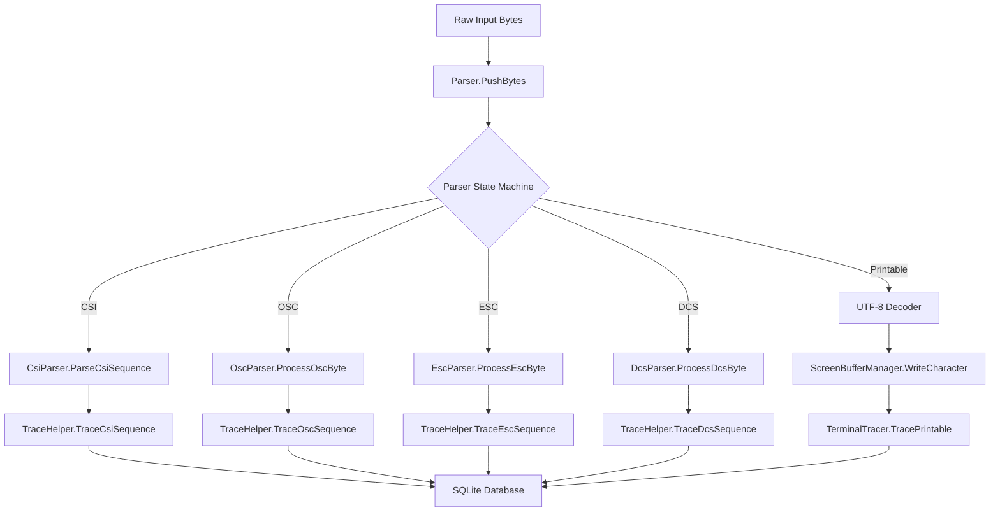

# Design Document

## Overview

This design integrates SQLite-based tracing capabilities into the existing caTTY terminal emulator parsing and processing pipeline. The tracing system will capture escape sequences and printable characters at key processing points, providing comprehensive debugging and analysis capabilities while maintaining minimal performance impact when disabled.

The integration leverages the existing TerminalTracer infrastructure and adds strategic tracing calls throughout the parser pipeline, screen buffer management, and character processing systems.

## Architecture

### Integration Points

The tracing integration follows a non-invasive approach, adding tracing calls at strategic points in the existing codebase without modifying core logic:



### Data Flow Direction Tracking

The system distinguishes between two data flow directions:
- **Input**: Data flowing from user/application into the terminal (keyboard input, paste operations)
- **Output**: Data flowing from the running program to the terminal display (program output, escape sequences)

## Components and Interfaces

### Enhanced TerminalTracer

The existing TerminalTracer will be enhanced with:

1. **Direction Support**: New overloads accepting direction parameter
2. **Type Classification**: New overloads accepting type parameter for sequence classification
3. **Database Schema Update**: Addition of `direction` and `type` columns to trace table
4. **Migration Support**: Graceful handling of existing databases

```csharp
public enum TraceDirection
{
    Input,   // Data from user/application to terminal
    Output   // Data from program to terminal display
}

public static class TerminalTracer
{
    // Enhanced methods with direction and type support
    public static void TraceEscape(string escapeSequence, TraceDirection direction = TraceDirection.Output, string? type = null, int? row = null, int? col = null);
    public static void TracePrintable(string printableText, TraceDirection direction = TraceDirection.Output, string? type = null, int? row = null, int? col = null);
    public static void Trace(string? escapeSequence, string? printableText, TraceDirection direction = TraceDirection.Output, string? type = null, int? row = null, int? col = null);
}
```

### Enhanced TraceHelper

TraceHelper will be extended with a new method for DCS sequences, direction support, and type classification:

```csharp
public static class TraceHelper
{
    // New DCS tracing method
    public static void TraceDcsSequence(string command, string? parameters = null, string? data = null, TraceDirection direction = TraceDirection.Output);
    
    // Enhanced existing methods with direction and type support
    public static void TraceCsiSequence(char command, string? parameters = null, char? prefix = null, TraceDirection direction = TraceDirection.Output);
    public static void TraceOscSequence(int command, string? data = null, TraceDirection direction = TraceDirection.Output);
    public static void TraceEscSequence(string sequence, TraceDirection direction = TraceDirection.Output);
    public static void TraceSgrSequence(string attributes, TraceDirection direction = TraceDirection.Output);
    public static void TraceControlChar(byte controlChar, TraceDirection direction = TraceDirection.Output);
    public static void TraceUtf8Text(string text, TraceDirection direction = TraceDirection.Output);
    public static void TraceWideChar(string character, int width, TraceDirection direction = TraceDirection.Output);
}
```

### Parser Integration Points

#### CsiParser Integration
- **Location**: `CsiParser.ParseCsiSequence()` method
- **Tracing**: Call `TraceHelper.TraceCsiSequence()` after successful parsing
- **Data**: Command character, parameters, prefix (if any)

#### OscParser Integration
- **Location**: `OscParser.ProcessOscByte()` when sequence completes
- **Tracing**: Call `TraceHelper.TraceOscSequence()` with parsed command and data
- **Data**: OSC command number, payload data

#### EscParser Integration
- **Location**: `EscParser.ProcessEscByte()` when sequence completes
- **Tracing**: Call `TraceHelper.TraceEscSequence()` with sequence characters
- **Data**: Complete escape sequence after ESC

#### DcsParser Integration
- **Location**: `DcsParser.ProcessDcsByte()` when sequence completes
- **Tracing**: Call `TraceHelper.TraceDcsSequence()` with parsed components
- **Data**: DCS command, parameters, data payload

#### Character Processing Integration
- **Location**: `ScreenBufferManager.WriteCharacter()` and related methods
- **Tracing**: Call `TerminalTracer.TracePrintable()` for displayed characters
- **Data**: Characters being written to screen buffer

## Data Models

### Enhanced Database Schema

The trace database schema will be updated to include direction and type tracking:

```sql
CREATE TABLE trace (
    id INTEGER PRIMARY KEY AUTOINCREMENT,
    time INTEGER NOT NULL,           -- Unix timestamp in milliseconds
    type TEXT,                       -- Type classification (CSI, OSC, ESC, DCS, SGR, printable, control, utf8, wide)
    escape_seq TEXT,                 -- Escape sequence (nullable)
    printable TEXT,                  -- Printable characters (nullable)
    direction TEXT NOT NULL DEFAULT 'output',  -- 'input' or 'output'
    row INTEGER,                     -- Cursor row position (nullable)
    col INTEGER                      -- Cursor column position (nullable)
);
```

### Type Classification System

The system will use the following type classifications:
- **"CSI"**: Control Sequence Introducer sequences (ESC[...)
- **"OSC"**: Operating System Command sequences (ESC]...)
- **"ESC"**: Simple escape sequences (ESC + single character)
- **"DCS"**: Device Control String sequences (ESCP...)
- **"SGR"**: Select Graphic Rendition sequences (subset of CSI for styling)
- **"printable"**: Regular printable text characters
- **"control"**: Control characters (0x00-0x1F, 0x7F)
- **"utf8"**: UTF-8 multi-byte character sequences
- **"wide"**: Wide characters (CJK, emoji) that occupy multiple columns

### Migration Strategy

For existing databases, the system will:
1. Detect missing `direction` and `type` columns on first access
2. Add columns with `ALTER TABLE` statements
3. Set default values ('output' for direction, null for type) for backward compatibility
4. Handle migration failures gracefully

### Test Database Configuration

Test databases will use UUID-based filenames in the assembly directory:

```csharp
public static class TestTraceDatabase
{
    public static string CreateTestDatabasePath()
    {
        var assemblyDir = Path.GetDirectoryName(Assembly.GetExecutingAssembly().Location);
        var testId = Guid.NewGuid().ToString("N");
        return Path.Combine(assemblyDir, $"test_trace_{testId}.db");
    }
}
```

## Correctness Properties

*A property is a characteristic or behavior that should hold true across all valid executions of a system-essentially, a formal statement about what the system should do. Properties serve as the bridge between human-readable specifications and machine-verifiable correctness guarantees.*

### Property 1: Escape Sequence Tracing Completeness
*For any* valid escape sequence (CSI, OSC, ESC, DCS) processed by the parser, the sequence should appear in the trace database with correct command, parameters, and direction information.
**Validates: Requirements 1.1, 1.2, 1.3, 1.4, 5.1, 5.2, 5.4, 5.5**

### Property 2: Control Character Tracing
*For any* control character (0x00-0x1F, 0x7F) processed by the parser, the character should be traced using the appropriate control character name.
**Validates: Requirements 1.5**

### Property 3: Printable Character Tracing
*For any* printable character written to the screen buffer, the character should appear in the trace database with correct position and direction information.
**Validates: Requirements 2.1, 2.4**

### Property 4: UTF-8 Character Tracing
*For any* UTF-8 multi-byte sequence decoded by the terminal, the resulting character should be traced with correct Unicode representation.
**Validates: Requirements 2.2**

### Property 5: Wide Character Tracing
*For any* wide character (CJK, emoji) processed by the terminal, the character should be traced with appropriate width indication.
**Validates: Requirements 2.3**

### Property 6: SGR Sequence Tracing
*For any* SGR (Select Graphic Rendition) sequence processed by the parser, the sequence should be traced with complete attribute change information.
**Validates: Requirements 5.3**

### Property 7: Direction Tracking Accuracy
*For any* traced sequence or character, the direction field should correctly reflect whether the data originated from user input ("input") or program output ("output").
**Validates: Requirements 8.1, 8.2**

### Property 8: Performance When Disabled
*For any* tracing call when TerminalTracer.Enabled is false, the call should return in less than 5 nanoseconds without performing database operations or string formatting.
**Validates: Requirements 4.1, 9.2, 9.3**

### Property 9: Unconditional Tracing Calls
*For any* terminal processing operation, tracing functions should be called regardless of the enabled state, relying on TerminalTracer.Enabled for performance optimization.
**Validates: Requirements 9.1, 9.4**

### Property 10: Error Handling Resilience
*For any* tracing operation that encounters database failures or exceptions, the terminal processing should continue without interruption and errors should be logged without throwing exceptions.
**Validates: Requirements 4.3, 4.4, 11.1, 11.2, 11.4**

### Property 11: Database Connection Recovery
*For any* database connection loss during tracing, the system should attempt reconnection on the next trace operation and handle SQLite busy errors gracefully.
**Validates: Requirements 11.3, 11.5**

### Property 12: Test Database Isolation
*For any* concurrent test execution, each test should use a separate UUID-based database file to ensure test isolation.
**Validates: Requirements 6.5**

### Property 13: Direction Query Filtering
*For any* trace database query with direction filter, the results should contain only traces matching the specified direction ("input" or "output").
**Validates: Requirements 8.5**

### Property 14: Direction Information Exposure
*For any* trace entry read from the database, the direction information should be accessible and correctly populated.
**Validates: Requirements 10.3**

### Property 15: Default Direction Handling
*For any* trace operation where direction is not explicitly specified, the system should use "output" as the default direction value.
**Validates: Requirements 10.5**

### Property 16: Human-Readable Escape Sequence Formatting
*For any* escape sequence traced to the database, the sequence should be formatted using consistent `\x1b...` notation with proper hexadecimal representation for control characters.
**Validates: Requirements 12.1, 12.2, 12.3, 12.4, 12.5, 12.6, 12.7**

### Property 17: Type Classification Accuracy
*For any* traced entry, the type field should correctly classify the entry as CSI, OSC, ESC, DCS, SGR, printable, control, utf8, or wide based on the content.
**Validates: Requirements 13.1, 13.2, 13.3, 13.4, 13.5, 13.6, 13.7, 13.8, 13.9**

### Property 18: Type Query Filtering
*For any* trace database query with type filter, the results should contain only traces matching the specified type classification.
**Validates: Requirements 13.10**

### Property 19: Default Type Handling
*For any* trace operation where type is not explicitly specified, the system should use an appropriate default type value based on the content being traced.
**Validates: Requirements 13.11**

## Error Handling

### Database Initialization Failures
- SQLite database creation failures are logged but do not prevent terminal startup
- Missing database files are created automatically on first trace
- Invalid database schemas trigger migration attempts

### Runtime Error Recovery
- Database write failures are logged and do not interrupt terminal processing
- Connection losses trigger automatic reconnection attempts
- SQLite busy/locked errors are handled with appropriate timeouts

### Test Environment Error Handling
- Test database creation failures cause test failures (not silent failures)
- Test cleanup failures are logged but do not fail tests
- Concurrent test database access is handled through unique filenames

## Testing Strategy

### Unit Tests
Unit tests will verify specific examples and edge cases:
- Database schema creation and migration
- Error handling for various failure scenarios
- Test database isolation and cleanup
- Direction field population and querying

### Property-Based Tests
Property-based tests will verify universal properties across all inputs using FsCheck.NUnit with minimum 100 iterations:
- **Property 1**: Generate random escape sequences, verify tracing completeness
- **Property 2**: Generate random control characters, verify tracing with correct names
- **Property 3**: Generate random printable characters, verify screen buffer tracing
- **Property 4**: Generate random UTF-8 sequences, verify decoding and tracing
- **Property 5**: Generate random wide characters, verify width indication tracing
- **Property 6**: Generate random SGR sequences, verify attribute tracing
- **Property 7**: Generate mixed input/output data, verify direction tracking
- **Property 8**: Measure performance with tracing disabled, verify <5ns overhead
- **Property 9**: Verify tracing calls are made regardless of enabled state
- **Property 10**: Simulate database failures, verify error handling resilience
- **Property 11**: Simulate connection issues, verify recovery behavior
- **Property 12**: Run concurrent tests, verify database isolation
- **Property 13**: Query traces with direction filters, verify filtering accuracy
- **Property 14**: Read trace entries, verify direction information exposure
- **Property 15**: Trace without specifying direction, verify default behavior
- **Property 16**: Generate random escape sequences, verify human-readable `\x1b...` formatting
- **Property 17**: Generate mixed trace entries, verify type classification accuracy
- **Property 18**: Query traces with type filters, verify filtering accuracy
- **Property 19**: Trace without specifying type, verify default type behavior

Each property test will be tagged with: **Feature: terminal-tracing-integration, Property {number}: {property_text}**

### Integration Tests
Integration tests will verify end-to-end tracing behavior:
- Complete terminal sessions with mixed escape sequences and text
- Real-world terminal applications (vim, htop) with tracing enabled
- Performance benchmarks with tracing enabled vs disabled
- Database migration from old schema to new schema with direction and type columns